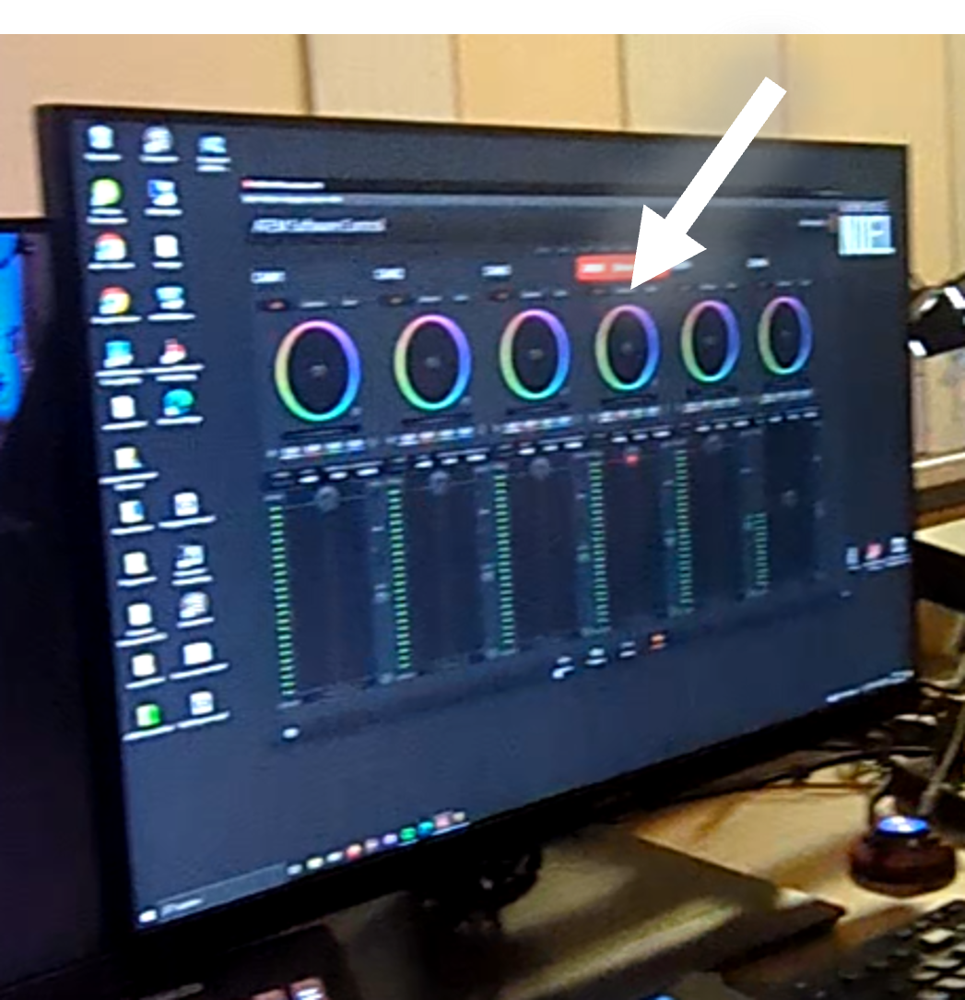

# ATEM Bildmischer

---

# Hardware

- Der ATEM Bildmischer ist dafür da, alle Bildsignale aufzunehmen und in einer 'Multiview' aufzubereiten

---

# Software

- Hier wird die Software gestartet

- Hier können Einstellungen der Kameras überprüft und eingestellt werden

---

# Multiview

- In der Multiview werden die verschiedenen Eingangssignale des Bildmischers geordnet angezeigt

