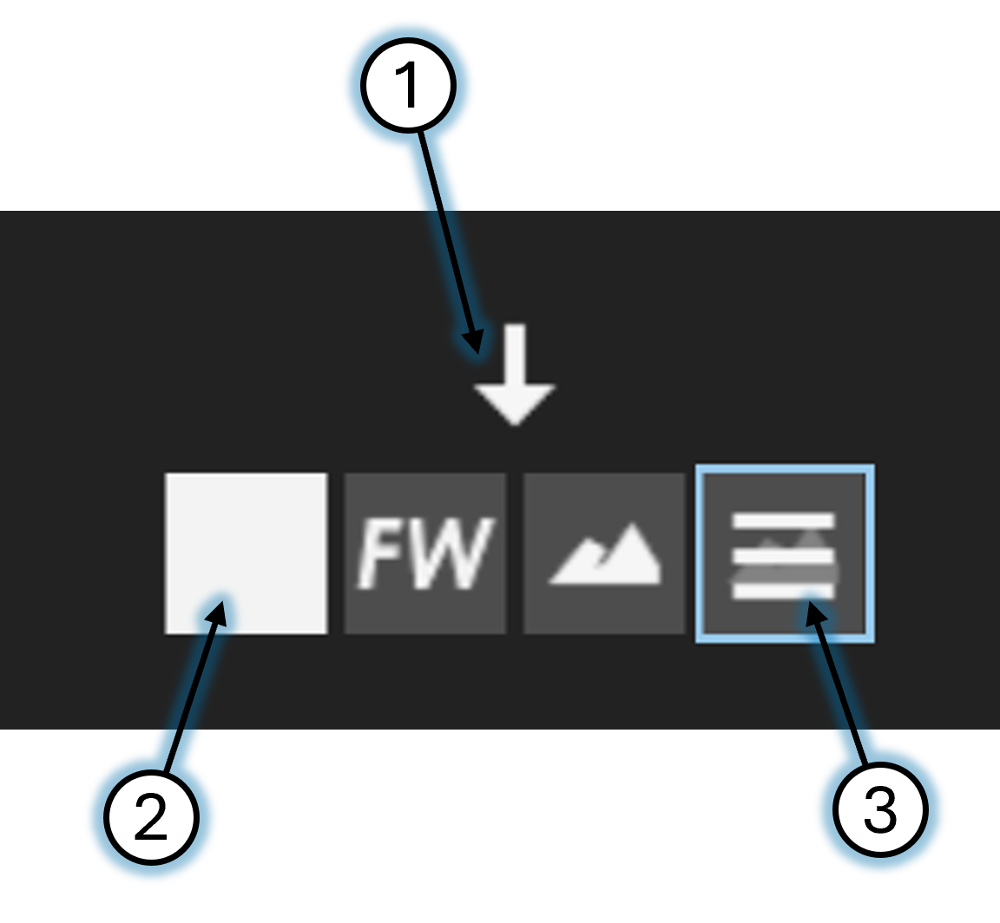
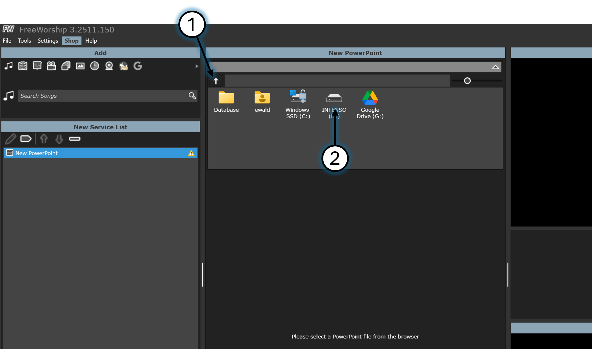
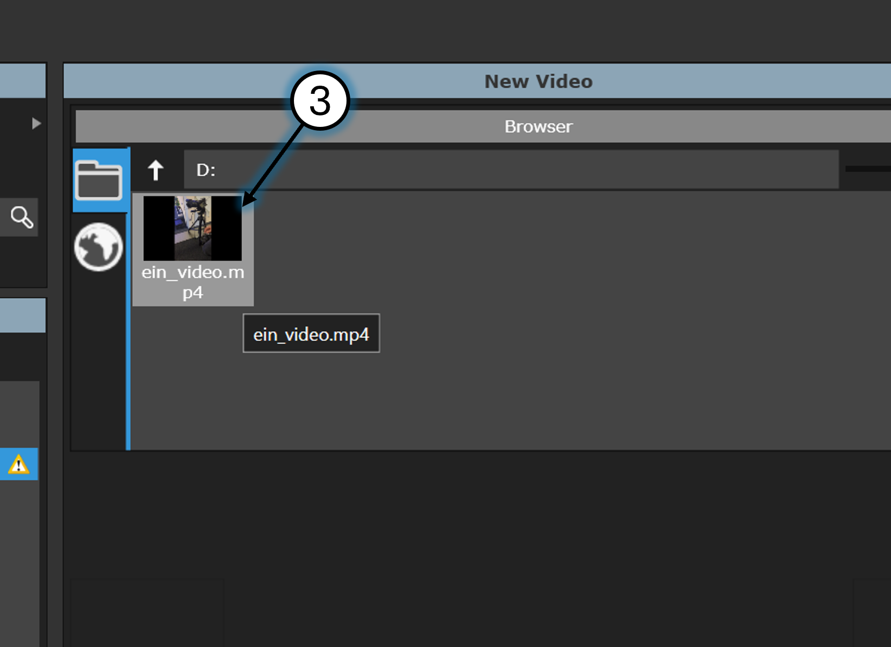
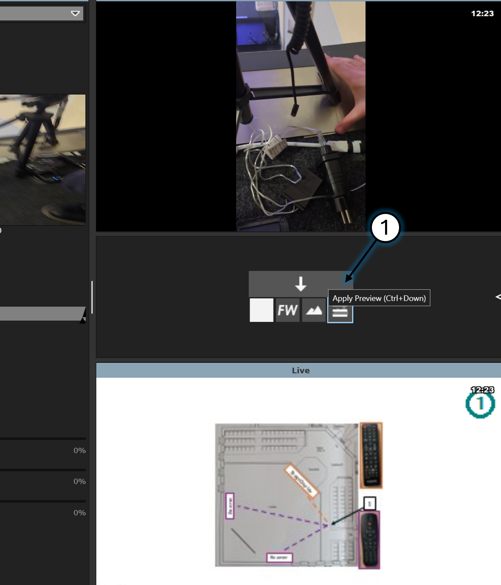

# Beamer (Basic)

---

## FreeWorship starten

> ✅ Starte die Software 'FreeWorschip'
> 
> 

---

## Präsentation zeigen

> ✅ Klicke auf 'Powerpoint'
> 
> 

> ✅ Durchsuche den Pc nach der entsprechenden Datei (im Beispiel ist die Datei auf einem USB-Stick)
>
> 1. Einen Ordner/Datenträger zurück
> 2. In den Ordner/Datenträger rein
>
> 
>
> 

> ✅ Starte die Präsentation
>
> 1. Präsentation auswählen
> 2. Die entsprechende Folie anklicken
> 3. Auf 'Apply Preview' klicken
> 4. Auf 'Show Content' klicken
>
> 

> ℹ️ Steuerung
>
> 1. Bild von 'Preview'(nur zur Vorschau) auf 'Live'(Auf den Beamer) schalten
> 2. Bild ausblenden
> 3. Bild anzeigen
>
> 

## Video zeigen

> ✅ Klicke auf 'Video'
> 
> 

> ✅ Durchsuche den Pc nach der entsprechenden Datei (im Beispiel ist die Datei auf einem USB-Stick)
>
> 1. Einen Ordner/Datenträger zurück
> 2. In den Ordner/Datenträger rein
>
> 
>
> 

> ✅ Starte das Video
> 1. Das Video wird erst auf dem Beamer abgespielt, wenn du Apply Preview anklickst
> 
> 
> 1. Durch das ziehen des Rechtecks, kannst du das Video vor/zurück-spuhlen
> 2. Hier pausierst du das Video oder setzt die Wiedergabe fort
> 

