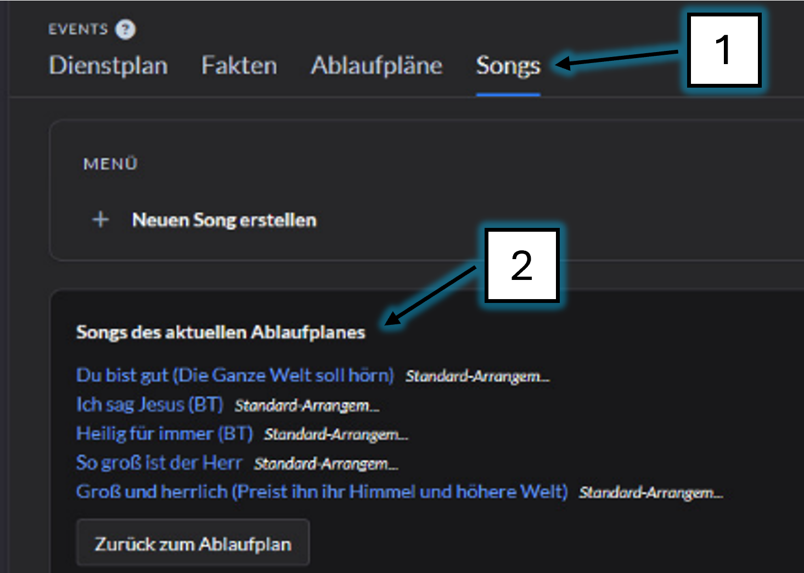

# ChurchTools

---

## Ablauf anzeigen

Rufe die anstehenden Events auf

Wähle den Ablaufplan der aktuellen Veranstaltung 

Gehe auf den Reiter 'Songs' (1)

Die anstehenden Songs wenden hier (2) angezeigt

