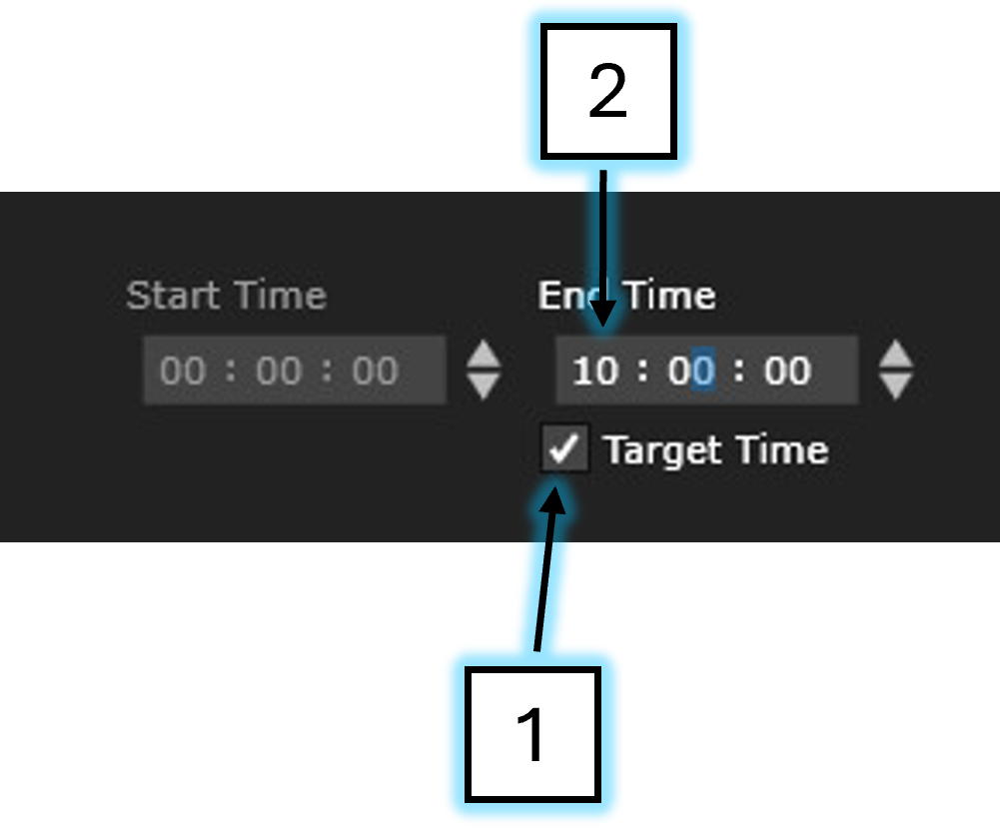
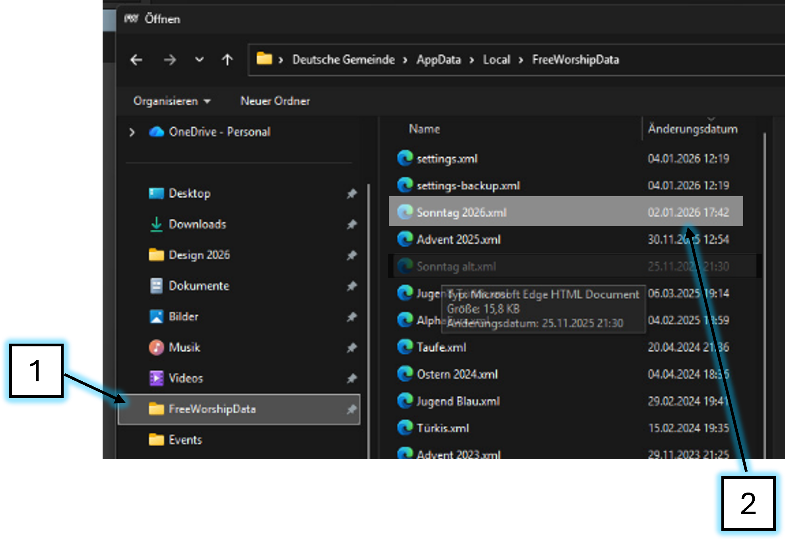
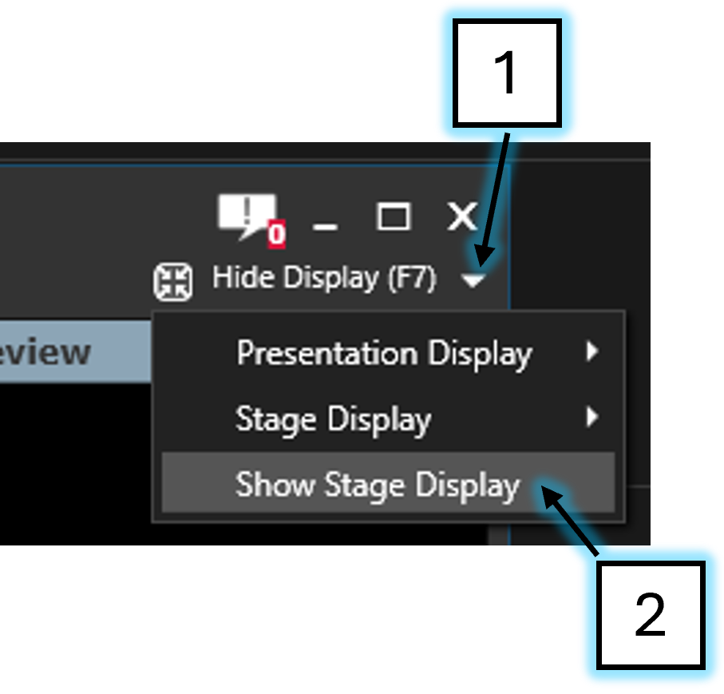
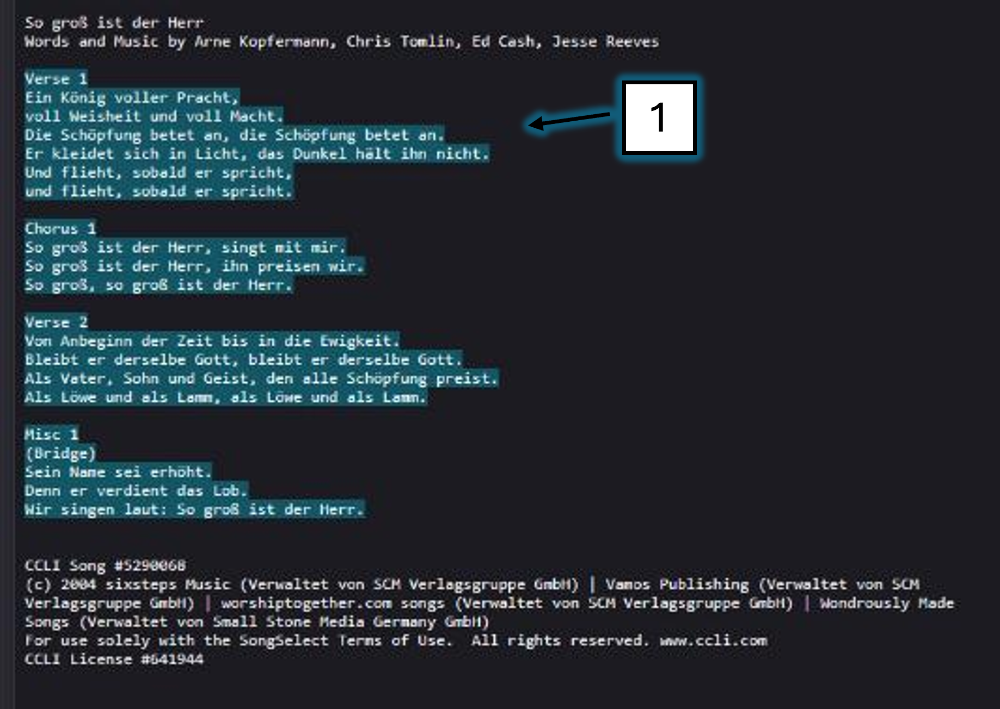

# FreeWorship

---

## Starten

---

## Timer

Wenn hier 'Target Time' ausgewählt ist, wird hier die Uhrzeit eingestellt, bis zu der herungergezählt wird.

Und zwar in diesem Format HH:MM:SS

---

## Settings

---

## Stage Display

Der Stage Display ist der Bildschirm, der am Balkon hängt.
Er ist für den Sprecher und die Band da.

Um den Stage Display anzuzeigen, musst du folgendermaßen vorgehen:

Klicke auf den Pfeil (1) oben rechts in der Ecke.
Klicke auf 'Show Stage Display'.

Hier kannst du sehen was auf dem Stage Display gezeigt wird

---

## Beamerbild Anzeigen

---

## Song importieren

Um einen Song zu importieren, klickst du auf das Noten-Symbol dann gibst du im Suchfeld einen Teil des Song-Namens ein. Von den Suchergebnissen klickst du dann den richtigen Treffer an.

> ⚠️ Viele Songs heißen ähnlich - Prüfe besser genau ob es der gleiche Song wie im ChurchTools-Ablauf ist

---

## Song erstellen

Wenn ein Song in der FreeWorship Datenbank nicht existiert, kannst du so einen neuen Song erstellen:

Öffne in ChurchTools den Songtext indem du auf den Reiter Songs (1) gehst und und dort die entsprechende '<Songtext>.txt'(2) auswählst.

Dann kopierst du den Songtext in die Zwischenablage (strg+c)

In FreeWorship klickst du auf 'Tools'(1) > 'Create Song'(2)

Hier trägst du den Songtitel ein (1) und fügst den Songtext aus der Zwischenablage unter 'Lyrics'(2) ein (strg+v)

Zuletzt bearbeitest du noch den Text damit er auf dem Beamer schöner aussieht.
Dazu gibt es folgende Formatierungs-Regeln:
> 1. Keine Satzeichen am Ende der Zeile
> 2. Zeilen nicht zu lang
> 3. Anfangsbuchstaben je Zeile groß

(In diesem Bild ist die 'Regel 3' noch nicht angewendet)

---

## Präsentation importieren

Es gibt unterschiedliche Wege, wie Prediger die Präsentation zur Verfügung stellen.
> [WhatsApp](../anleitungen/whatsapp.md)
> OneDrive
> USB-Stick

In jedem Fall muss die Präsentation durch FreeWorship-Datei-Browser importiert werden

Klicke auf das Symbol 'PowerPoint'

Durchsuche die Festplatte nach der Präsentation oder gib den Pfad direkt ein

Klicke die Präsentation doppelt an

