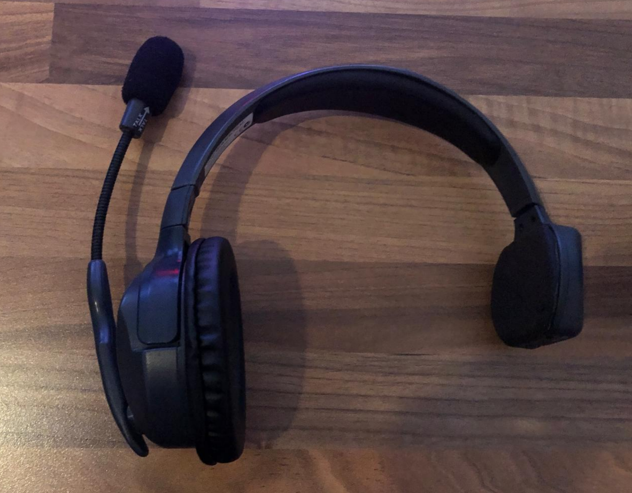
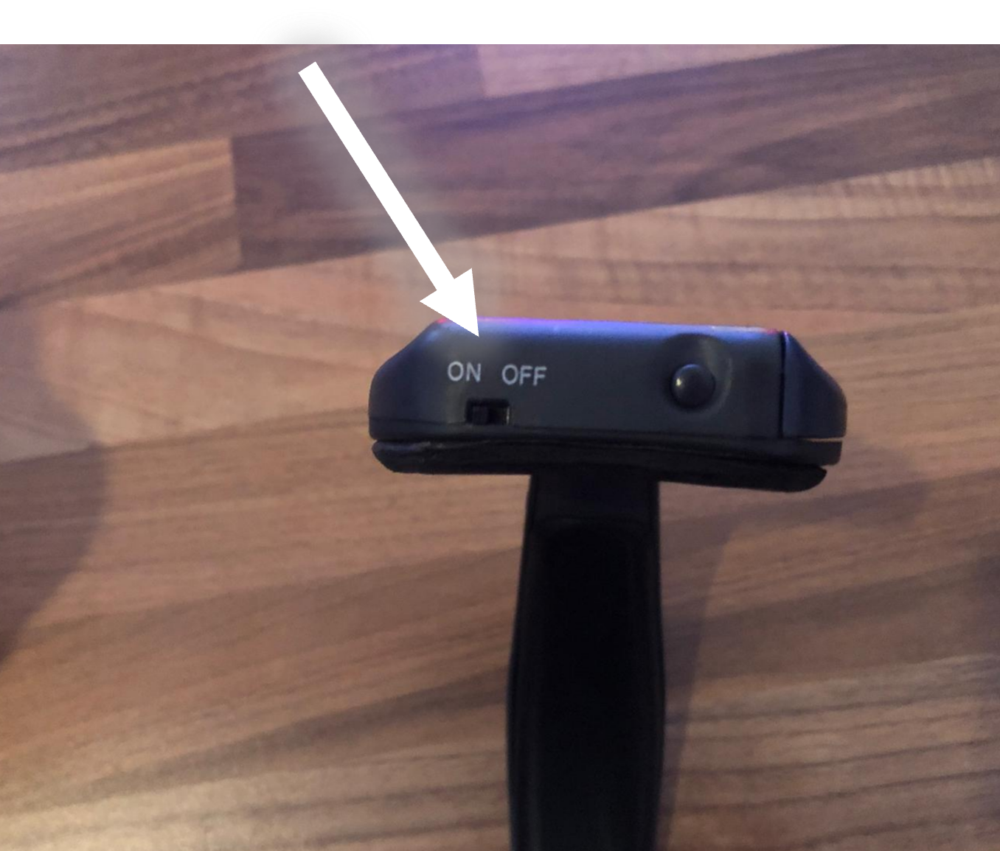
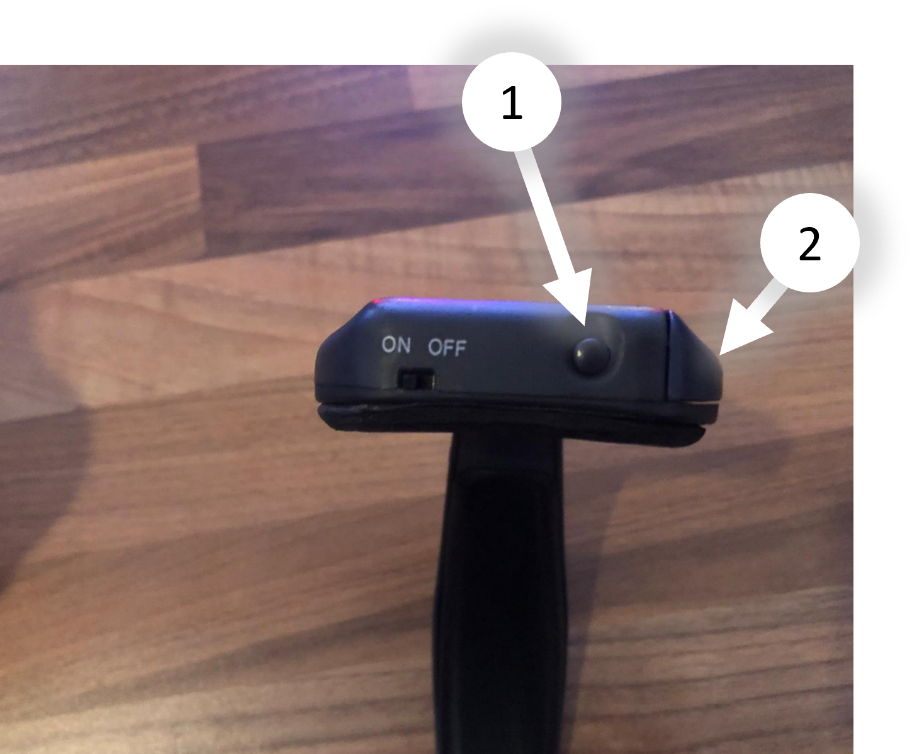

# Headset

---

- Mit den Headsetst kommuniziert die Regie mit den Kameraleuten.

---

## Master - Headset

⚠️ Bitte beachten dass das Headset mit dem On/Off schalter für die Regie ist

---

## Akku

Mit diesem Knopf (1) lässt sich die Akku-Klappe (2) öffnen

