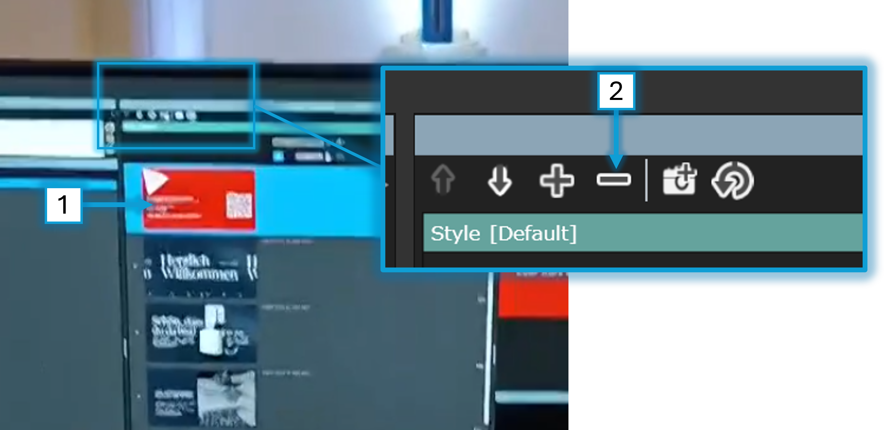
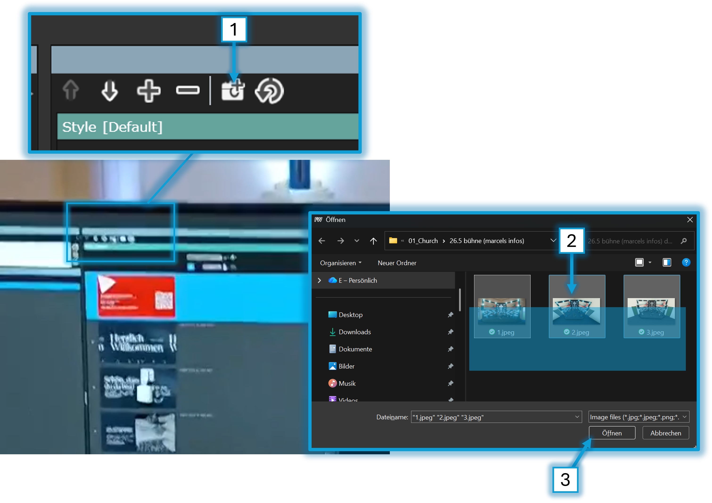

# Info-Folien anzeigen

---

## ⏰ 35min vor GoDi

### 🎬 Regie : Slideshow auf FreeWorship ist gestartet

> ✅ Starte FreeWorship auf dem Mischpult PC
> 
> 

> ✅ Öffne die Info-Slides
> 
> 

> ✅ Lösche Folien die nicht mehr relevant sind
> 
> 

> ✅ Füge Folien von neuen Events hinzu
> 
> 

> ✅ Starte den Slideshow-Loop
> 
> 