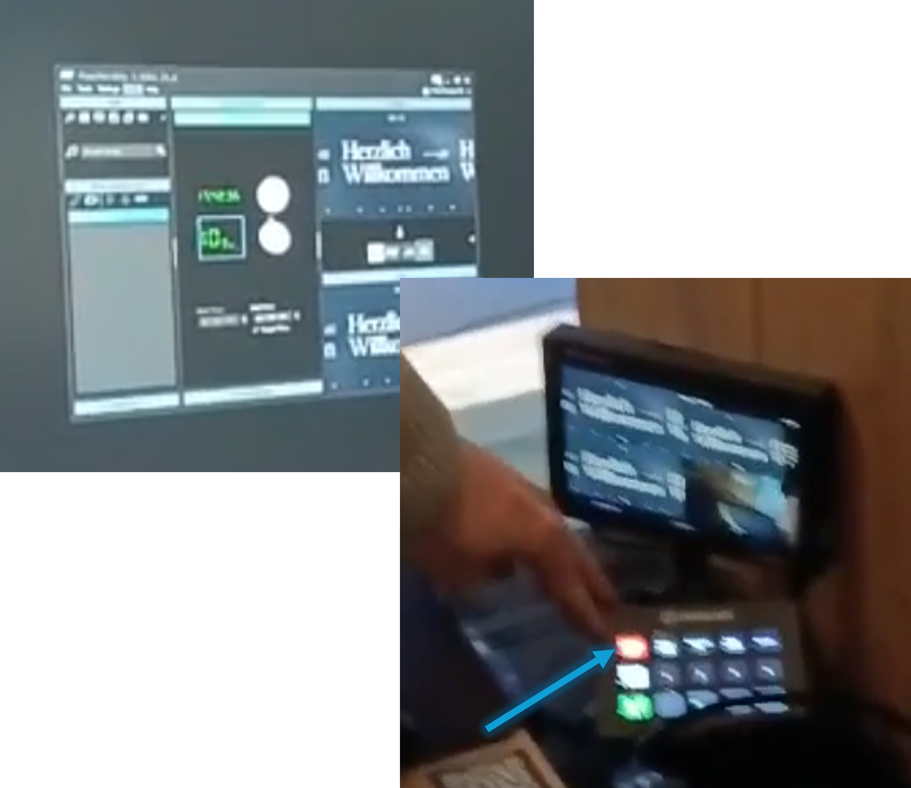

# Info-Folien anzeigen

---

## ⏰ 35min vor GoDi

### 🎬 Regie : Slideshow auf FreeWorship ist gestartet

> ✅ Starte FreeWorship auf dem Mischpult PC
> 
> 

> ✅ Öffne die Info-Slides
> 
> 

> ✅ Lösche Folien die nicht mehr relevant sind
> 
> 

> ✅ Füge Folien von neuen Events hinzu
> 
> 

> ✅ Starte den Slideshow-Loop
> 
> 

> ✅ Setzte Cut auf **Kanal 9**
> 
> 

---

## ⏰ 30min vor GoDi

### 🖥️ Beamer : Qelle ist auf Ton-PC gesetzt

> ✅ Timer auf 10:00 Uhr einstellen
> 
> ✅ Setze die Beamer-Quelle auf Tontechnik-PC
> 
> 

---

## ⏰ 1min vor GoDi

### 🖥️ Beamer : Quelle ist auf Beamer-PC gesetzt

> ✅ Zeige die Willkommen-Folie
> 
> ✅ Setze die Beamer-Quelle auf Beamer-PC
> 
> 

### 🎬 Regie : Cut ist auf Beamer-PC gesetzt

> ✅ Setzte Cut auf **Kanal 7**
> 
> 