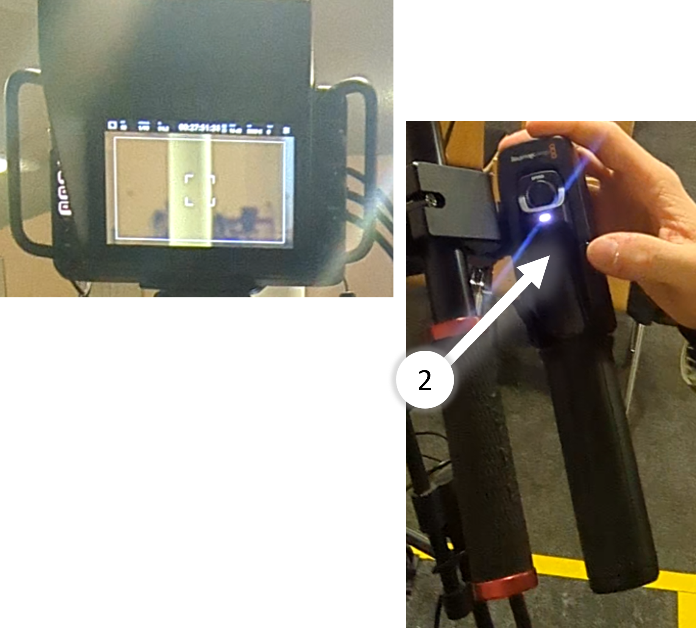

# Kamera 1

---

## Einschalten

- Strom einschalten

- Wenn Kamera nicht automatisch startet, Schalter betätigen

## Zusatzbildschirm

- Dieser Bildschirm zeigt den Kamera-Output
- Hat den Vorteil dass der Bediener bequem draufschauen kann
- Wenn Bildschirm nicht automatisch startet, Knopf drücken

---

## Parameter einstellen

### Blende
- ⚠️ Sollte auf 6.2 stehen
1. Bild-Einstellungen kommen von der Regie
2. Nur die Blendenöffnung muss kontrolliert werden

### Monitoring

**LCD** : Das ist der obere Kamera-Bildschirm
- Die Einstellungen betreffen nur das Bild für den Kameramann und haben keinen Einfluss auf das Bild, dass zur Regie geschickt wird.

**HDMI** : Das ist der untere Bildschirm
- Voreingestellt für Kamera-Output
- Kann über Makro geändert werden

**SDI** : Das ist das Bild, dass an die Regie geschickt wird
- ⚠️ Sollte auf CLEAN-FEED stehen
- Die Einstellungen betreffen das Bild, das an die Regie geschickt wird

---

## Macros ausführen

### Lifestream / Digitale Bildvergrößerung
1. Lifestream anzeigen
    - Gedrückt halten: Kurz anzeigen
    - Doppel-Tipp: Anzeigen Ein/Aus
    - Gut bei Predigt
    - Wenn Slides gezeigt werden kann das Bild besser eingestellt werden
2. Digitale Bild-Vergrößerung
    - Nur für den Bediener, Output bleibt unverändert
    - Bildausschnitt kann am Touchscreen verschoben/skaliert werden
    - zB. für Focus-Kontrolle

### Autofokus
- Drücken um Fokus automatisch zu setzen
- Manchmal nützlich um Einstellungen zu kontrollieren
- Meistens aber nicht besonders praktisch da Fehleranfällig und Langsam

---

## Regler

- Diese drei Regler haben keinen Einfluss auf das Ausgangs Signal
    - Bright: Helligkeit
    - Contrast: Kontrast
    - Peaking: Fokus Hilfe
    - Zeigt welche Tiefe scharf gestellt ist

