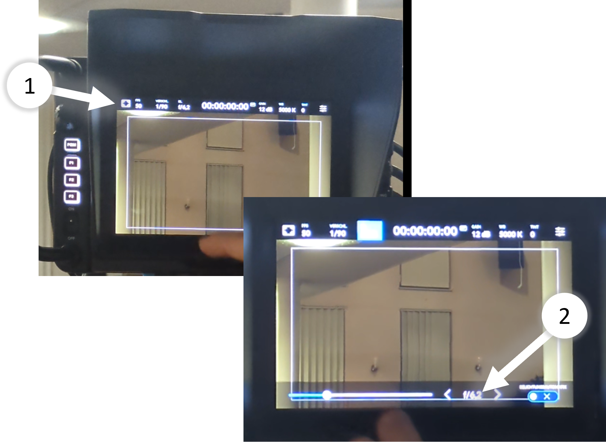

# Kamera 3

---

## Einschalten

- Strom einschalten

- Wenn Kamera nicht automatisch startet, Schalter betätigen

---

## Parameter einstellen

### Blende
- ⚠️ Sollte auf 6.2 stehen
1. Bild-Einstellungen kommen von der Regie
2. Nur die Blendenöffnung muss kontrolliert werden

### Monitoring

**LCD** : Das ist der obere Kamera-Bildschirm
- Die Einstellungen betreffen nur das Bild für den Kameramann und haben keinen Einfluss auf das Bild, dass zur Regie geschickt wird.

**HDMI** : Das ist der untere Bildschirm
- Voreingestellt für Kamera-Output
- Kann über Makro geändert werden

**SDI** : Das ist das Bild, dass an die Regie geschickt wird
- ⚠️ Sollte auf CLEAN-FEED stehen
- Die Einstellungen betreffen das Bild, das an die Regie geschickt wird

