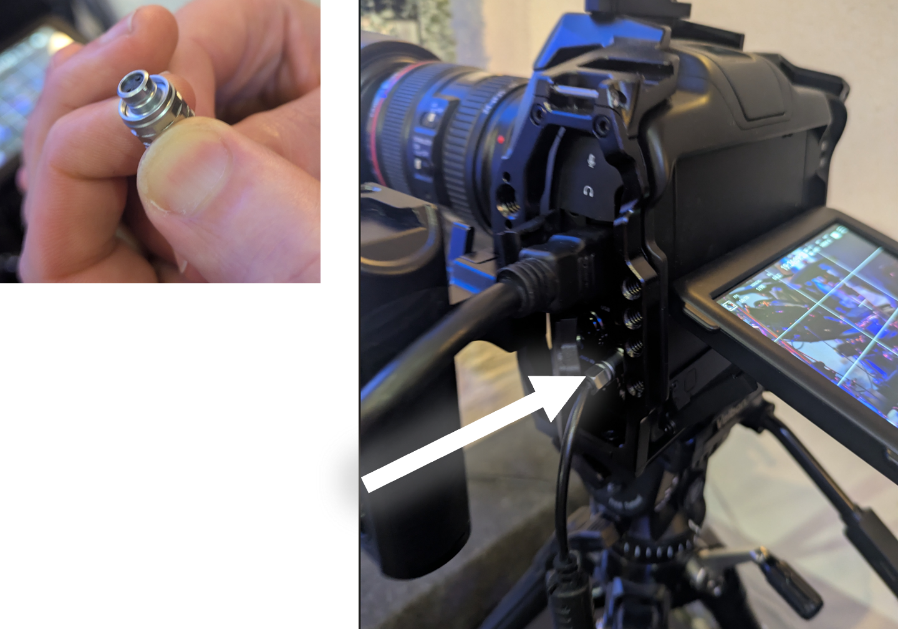
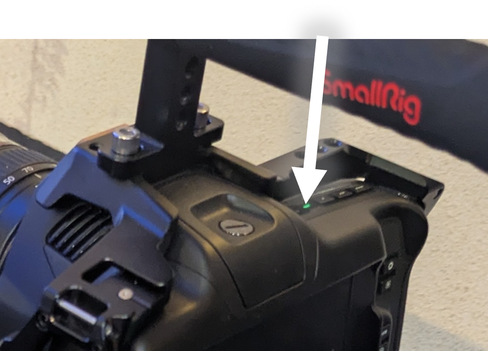
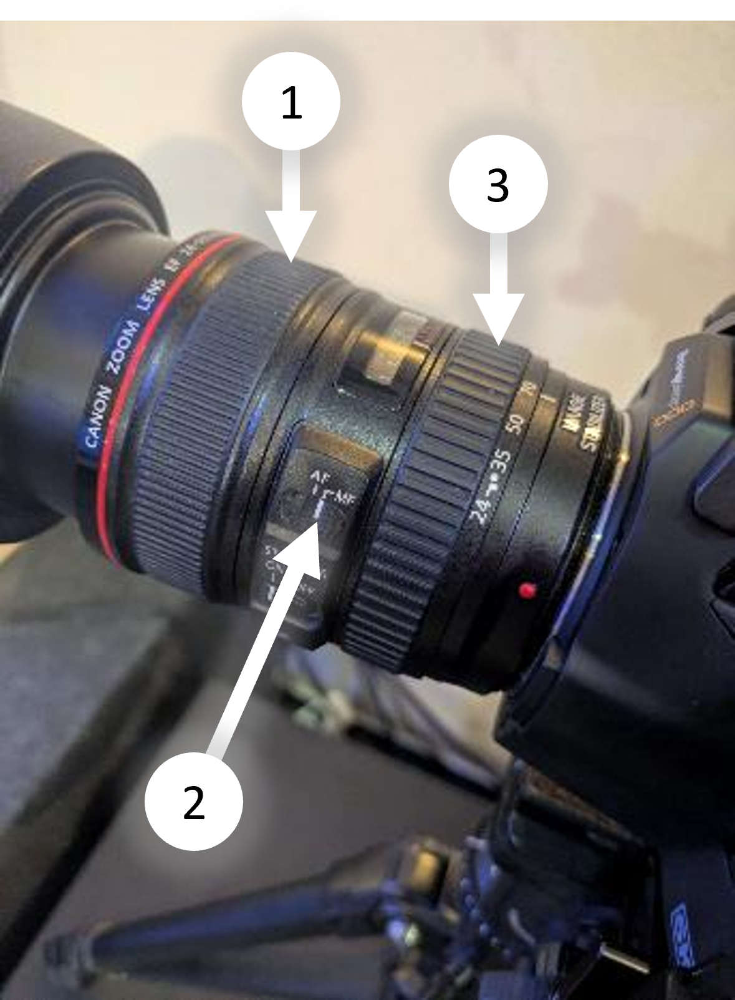

# Kamera 4

## Kamera einschalten
- Zuerst schließt du das Power-Kabel an

- Dann drückst du den Ein/Aus-Knopf

## Parameter - Monitoring
1. Unter ‘LCD’ sind die Einstellungen für den Kameramann. Die haben keinen Einfluss auf das Ausgangs-Signal.
2. Bei ‘HDMI’ sind die Einstellungen für das Bild, das an die Regie gesendet wird. Da sollte nur ‘CLEAN-FEED’ ausgewählt sein.

## Bedienen
1. Drehen zum Zoomen
2. Fokus Schalter
    - AF: Auto-Fokus
    - MF: Manueller-Fokus ← Sollte ausgewählt sein
3. Drehen  für Fokus

## Ausschalten
- Zuerst drückst du den Ein/Aus-Knopf

- Dann entfernst du das Power-Kabel

## Akku laden
- Der Akku muss auf die Ladestation im Technik-Raum
