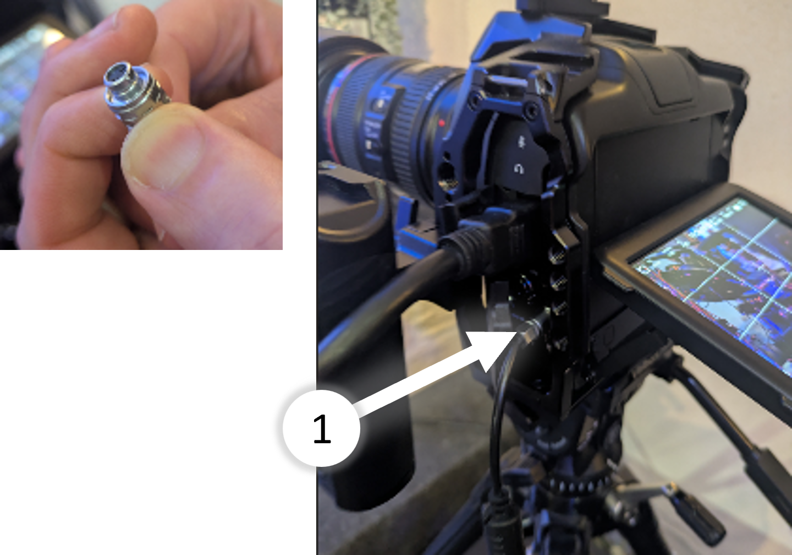

# Kamera 1

### Kamera einschalten
- Zuerst schließt du das Power-Kabel an

- Dann drückst du den Einschalt-Knopf

### Parameter - Monitoring
- (1) Unter ‘LCD’ sind die Einstellungen für den Kameramann. Die haben keinen Einfluss auf das Ausgangs-Signal.
- (2) Bei ‘HDMI’ sind die Einstellungen für das Bild, das an die Regie gesendet wird. Da sollte nur ‘CLEAN-FEED’ ausgewählt sein.

### Bedienen
- (1) Drehen zum Zoomen
- (2) Fokus Schalter
    - AF: Auto-Fokus
    - MF: Manueller-Fokus ← Sollte ausgewählt sein
- (3) Drehen  für Fokus

<i class='fa-regular fa-square-check'></i>
test oder was

- [ ] ein todo in einer Liste mit viel inhalt und mehreren zeilen
und so weiter und so fort...

- [ ] und einweiteres todo

- [ ] und einweiteres todo (2) Bei ‘HDMI’ sind die Einstellungen für das Bild, das an die Regie gesendet wird. Da sollte nur ‘CLEAN-FEED’ ausgewählt sein. (2) Bei ‘HDMI’ sind die Einstellungen für das Bild, das an die Regie gesendet wird. Da sollte nur ‘CLEAN-FEED’ ausgewählt sein.

<i class='fa-regular fa-square-check'></i>
ein todo als sonderzeichen

✅ ein todo als emoji

⚠️ ein warn emoji

---

> [!NOTE]
> General information or additional context.

> [!TIP]
> A helpful suggestion or best practice.

> [!IMPORTANT]
> Key information that shouldn't be missed.

> [!WARNING]
> Critical information that highlights a potential risk.

> [!CAUTION]
> Information about potential issues that require caution.

---

ende

ENDE