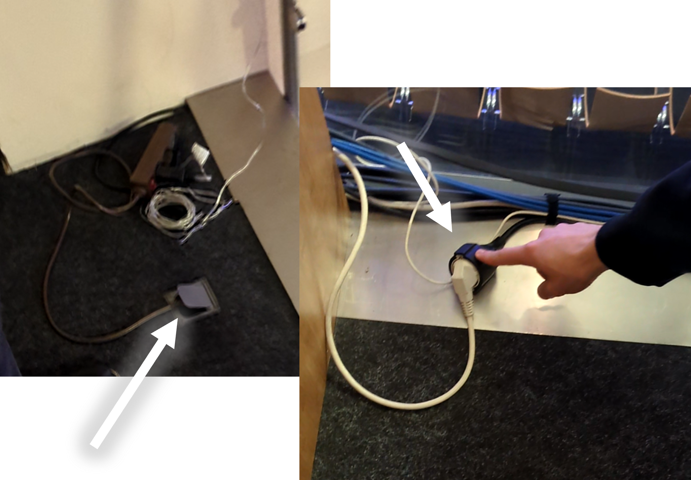

# Licht Strahler
- Mit (1) (2) (3) werden die Licht-Traversen eingeschaltet

- Die Strahler sind an wenn sie rot blinken

- Um die Strahler am Geländer einzuschalten musst du die Stecker einstecken.
