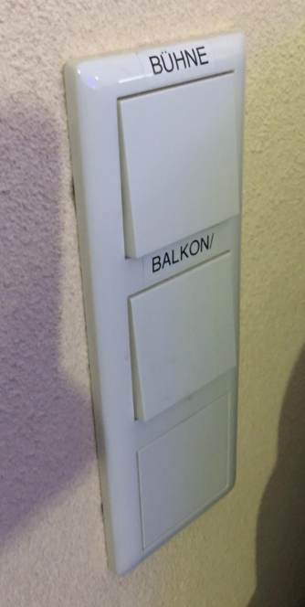

# Licht Strahler

---

# Beleuchtung
- Das Licht für Bühne und Balkon wird mit diesen Lichtschaltern ausgeschaltet

- Das Licht an den Wänden bleibt aber an

---

# Strahler
- Mit (1) (2) (3) werden die Licht-Traversen ein- und ausgeschaltet

- Die Strahler sind an wenn sie rot blinken

- Um die Strahler am Geländer einzuschalten musst du die Stecker einstecken.

