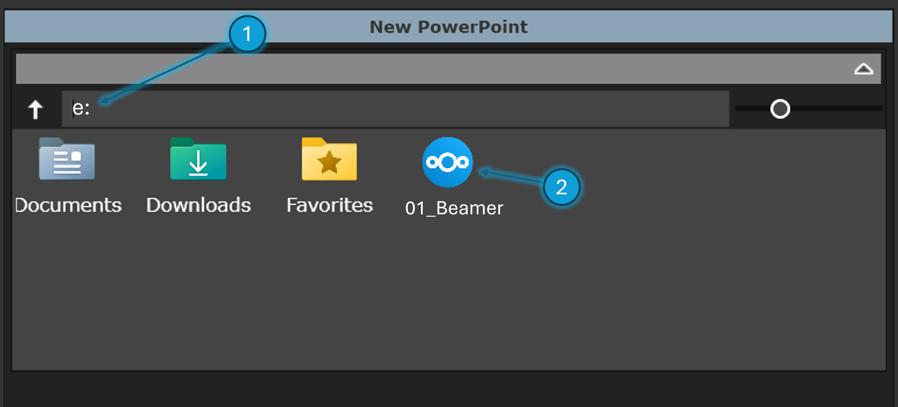
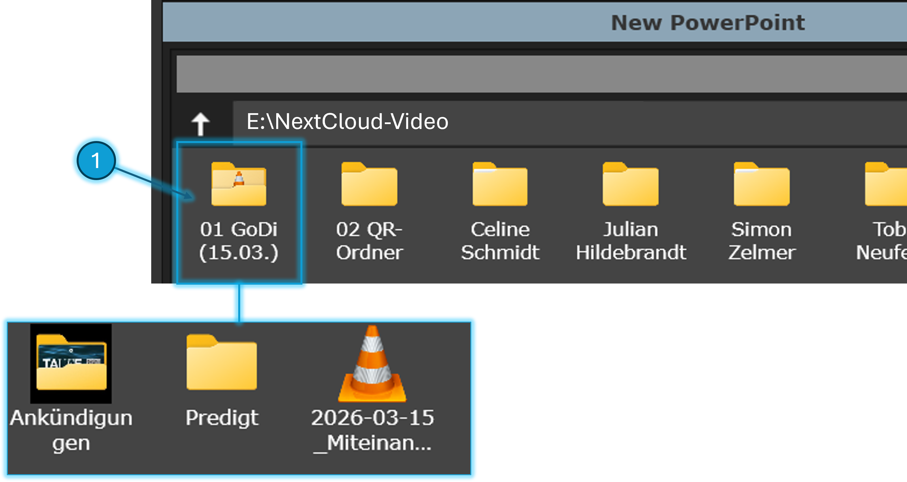
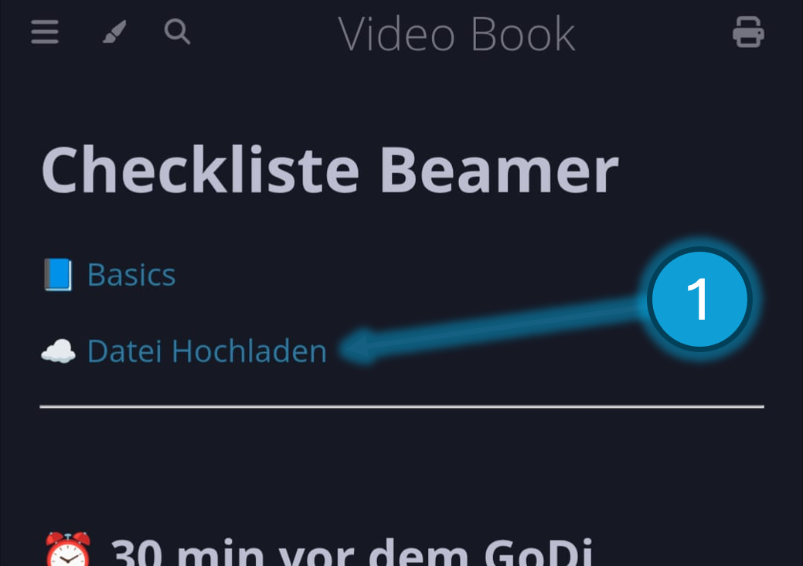
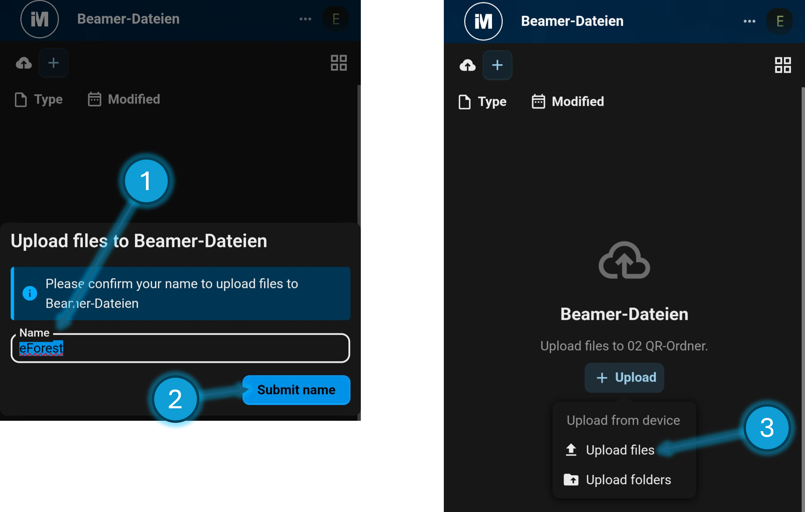
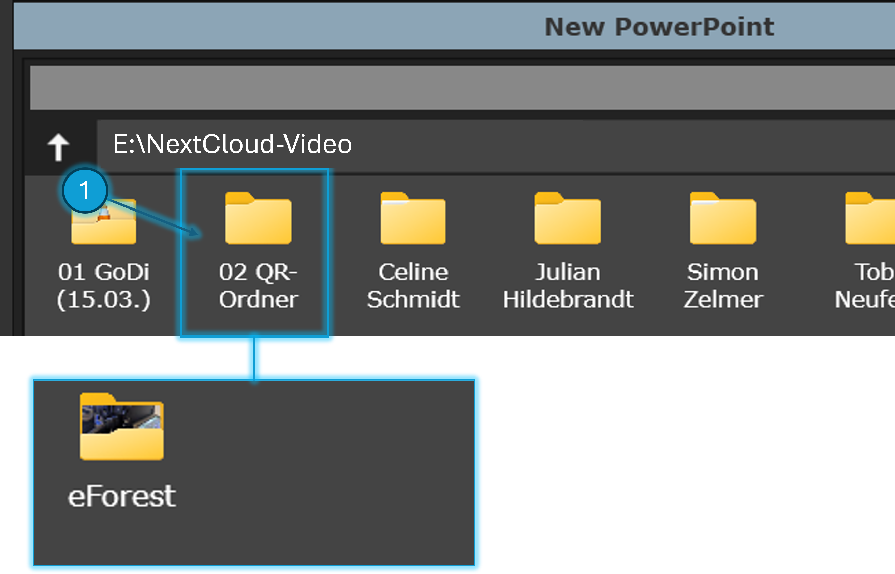

# NextCloud nutzen

## Dateien aus NextCloud in FreeWorship laden

Um Hektik und Stress am Sonntag zu reduzieren wollen wir die Relevanten Dateien (Folien, Predigt, Videos, ...) in passendem Format auf einem Austausch Ordner bei NextCloud bereitstellen.

> NextCloud ist jetzt so eingestellt, dass die Dateien auf dem Laufwerk 'E:' synchronisiert werden.
> Wenn ihr Dateien aus NextCloud nach FreeWorship laden wollt, könnt ihr in die Pfad-Leiste (1) einfach 'e:' tippen und das NextCloud-Symbol (2) anklicken
>
> 

> In diesem Ordner sind die Dateien (Predigt-Präsi, Ankündigung-Folien, Video, ...) für den jeweiligen Sonntags-GoDi
> 
> 

## Dateien vom Smartphone auf NextCloud laden

Außerdem gibt es jetzt eine Möglichkeit spontan Dateien hochzuladen ohne WhatsApp zu nutzen:

> Wenn man mit dem Handy den QR-Code am Beamer-Tisch scannt, gibt es da einen Knopf '☁️ Datei Hochladen'
> 

> Wenn ihr den anklickt, kann eine Datei von eurem Handy ausgewählt werden.
> 

> Die Datei erscheint dann in diesem Ordner.
> 