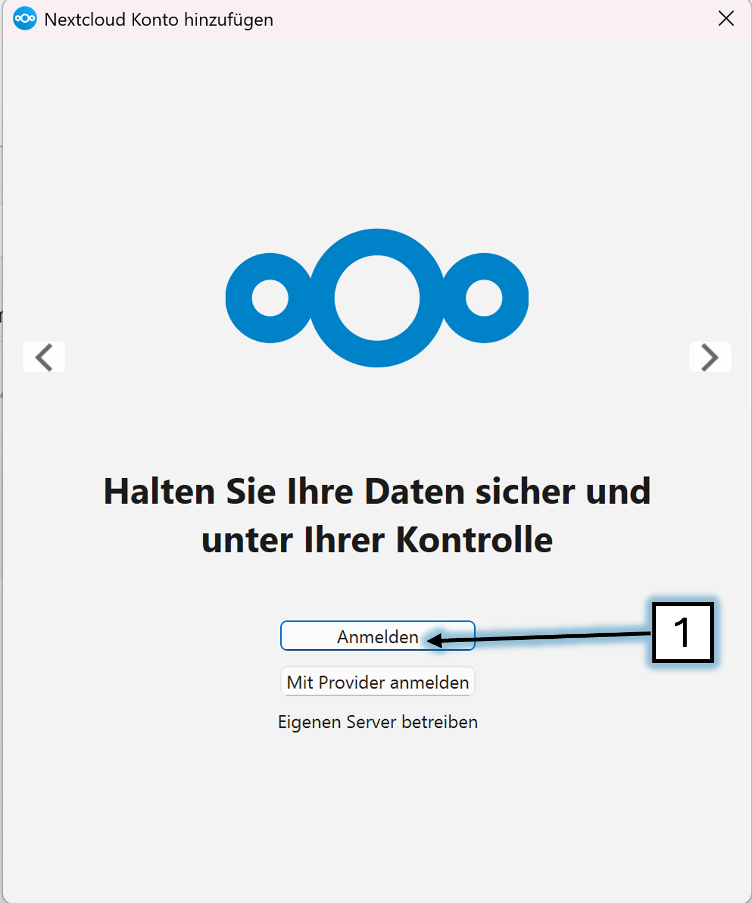
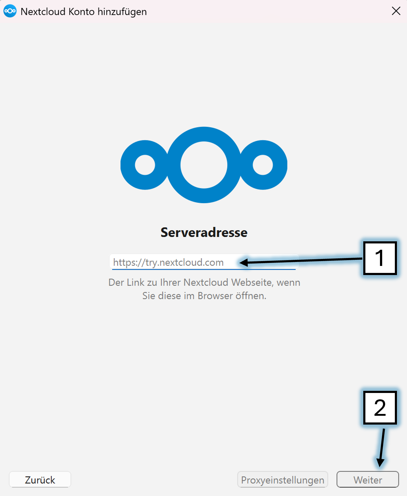
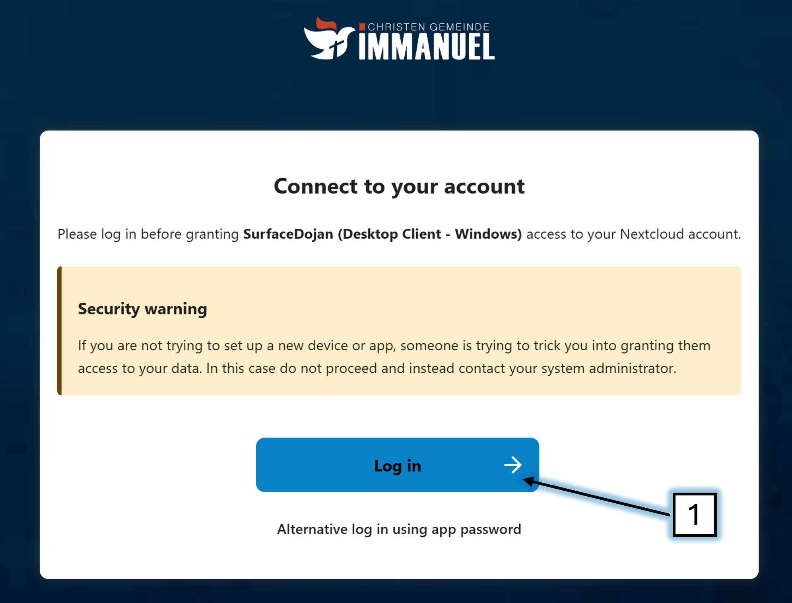
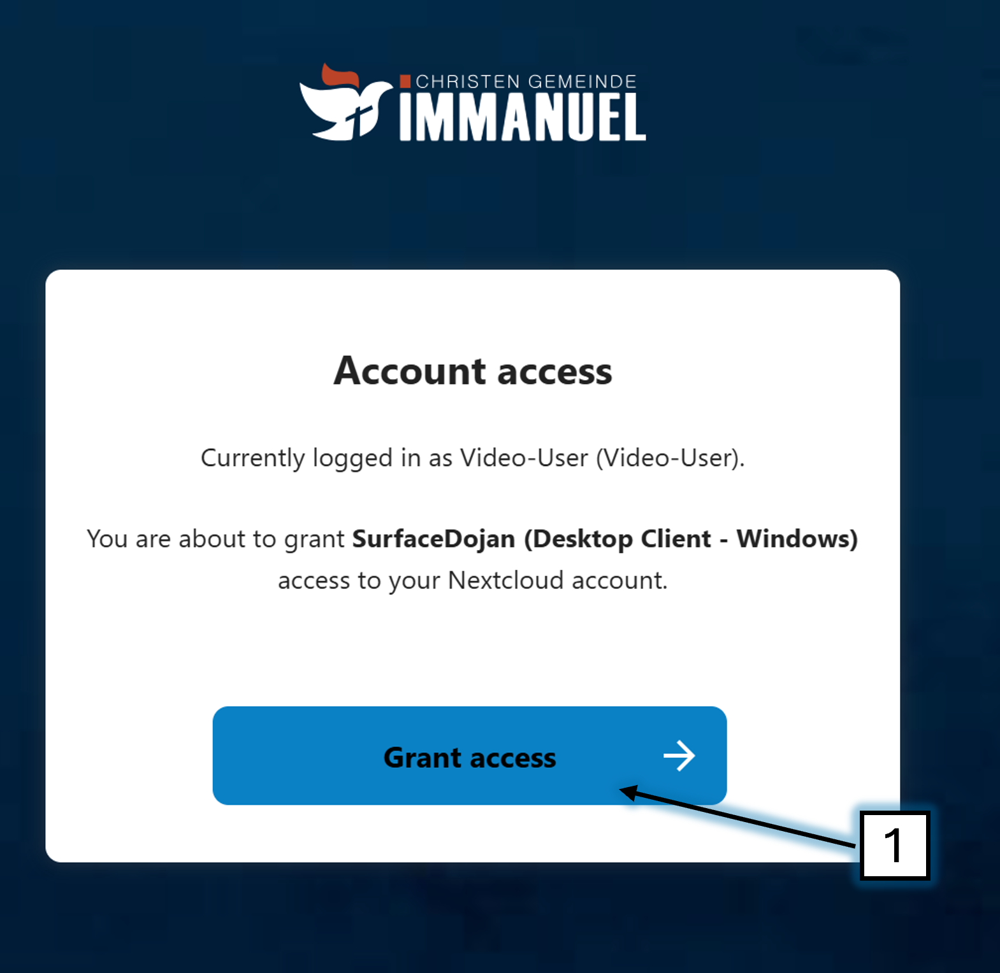
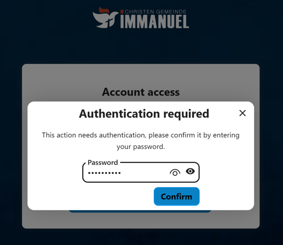
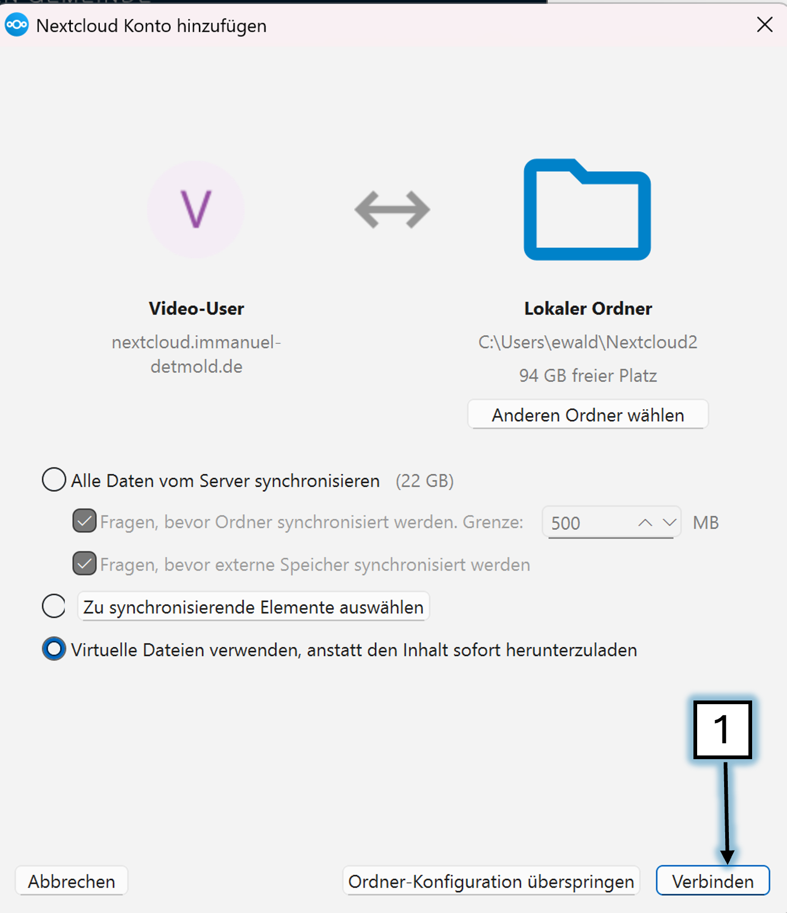
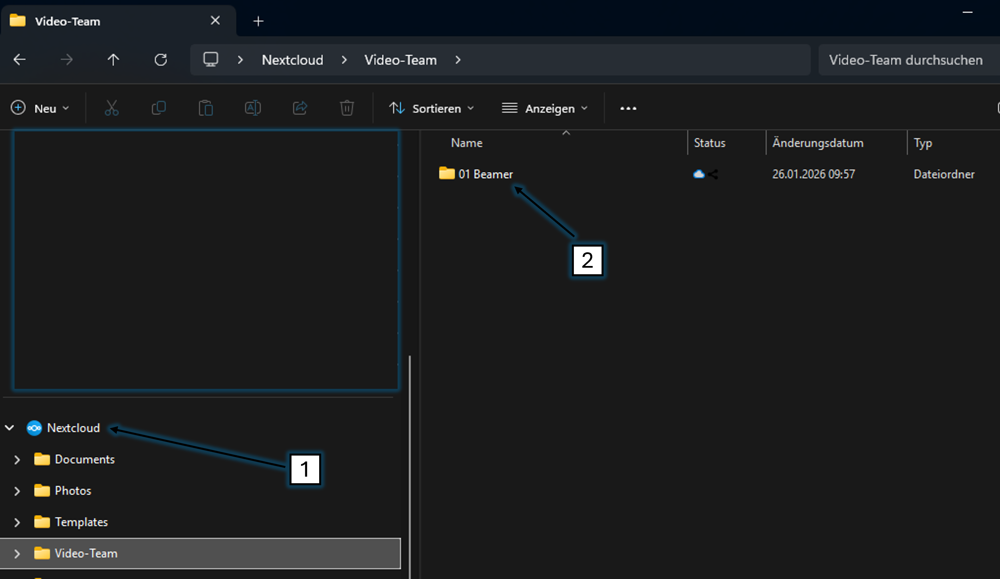

# NextCloud(Mac)

✅ Öffne im Browser: [nextcloud.com/clients](https://nextcloud.com/install/#install-clients)

✅ Unter Desktop Clients auf macOS klicken

✅ Die .dmg-Datei herunterladen

✅ DMG öffnen und Nextcloud.app in den Programme-Ordner ziehen

✅ Nextcloud starten (Programme → Nextcloud)

---

✅ Klicke auf 'Anmelden'



---

✅ Kopiere diese Serveradresse rein:

> ```
> https://nextcloud.immanuel-detmold.de
> ```

✅ Klicke auf 'Weiter'



---

✅ Klicke auf 'Log in'



---

✅ Klicke auf 'Grant access'



---

✅ Gib einen Nutzer ein

Wenn du Prediger bist: `Prediger`

Wenn du Präsentationsinhalte stellst: `Beamer-Support`

Wenn du zum Video-Team gehörst: `Video-User`

(Das Passwort bekommst du vom Admin)



!!;!;#

---

✅ Klicke auf 'Verbinden'



---

✅ Nun solltest du im Datei-Explorer 'NextCloud'1️⃣  haben und den Ordner '01 Beamer'2️⃣ sehen

Fertig 🥳

