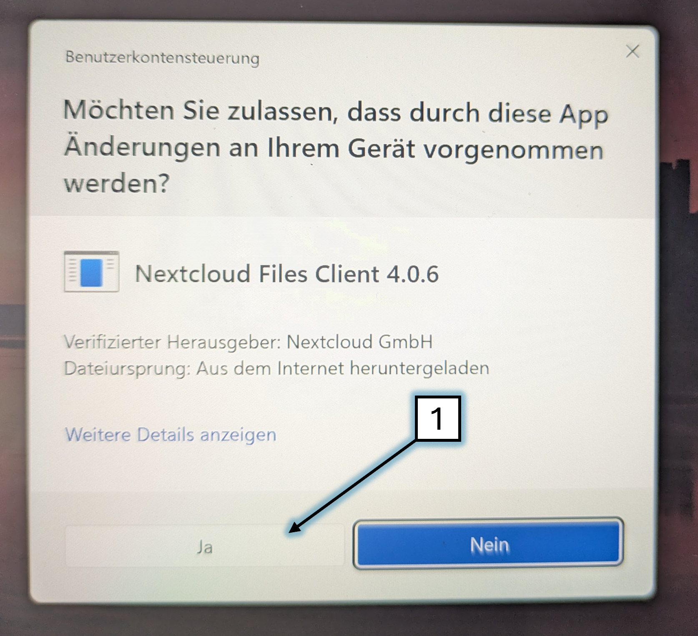
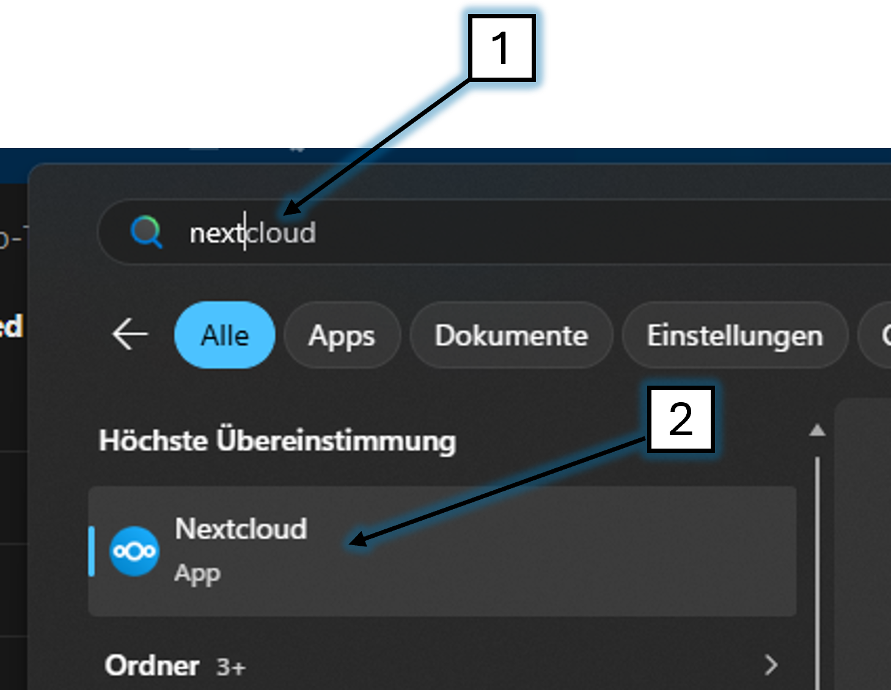

# NextCloud (Windows)

---

✅ Drücke auf der Tastatur 'Win' + 'R'

.png)

---

✅ Kopiere diesen Befehl da rein:

> ```
> winget install Nextcloud.NextcloudDesktop
> ```

.png)

✅ Und bestätige mit 'Y' 'Enter'

---

✅ Starte die Installation mit 'Ja'



---

✅ Warte einen Moment ... 'NextCloud - DeskClient' wird installiert ...

---

✅ Starte 'NextCloud'



---

✅ Klicke auf 'Anmelden'


---

✅ Kopiere diese Serveradresse rein:

> ```
> https://nextcloud.immanuel-detmold.de
> ```

✅ Klicke auf 'Weiter'


---

✅ Klicke auf 'Log in'


---

✅ Klicke auf 'Grant access'


---

✅ Gib einen Nutzer ein

Wenn du Prediger bist: `Prediger`

Wenn du Präsentationsinhalte stellst: `Beamer-Support`

Wenn du zum Video-Team gehörst: `Video-User`

(Das Passwort bekommst du vom Admin)


!!;!;#

---

✅ Klicke auf 'Verbinden'


---

✅ Nun solltest du im Datei-Explorer 'NextCloud'1️⃣  haben und den Ordner '01 Beamer'2️⃣ sehen

Fertig 🥳

