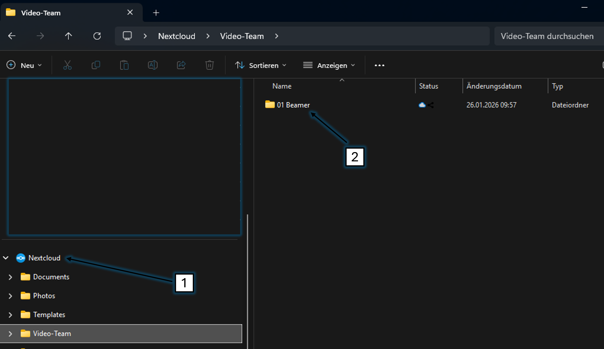

# NextCloud (Windows)

---

✅ Drücke auf der Tastatur 'Win' + 'R'

.png)

---

✅ Gib diesen Befehl ein: 'winget install Nextcloud.NextcloudDesktop'

.png)

---

✅ Bestätige mit 'Ja'

---
>
> ... 'NextCloud' wird installiert ...
>
---

✅ Starte 'NextCloud'

---

✅ Klicke auf 'Anmelden'

---

✅ Gib diese Serveradresse ein: 'https://nextcloud.immanuel-detmold.de'

✅ Klicke auf 'Weiter'

---

✅ Klicke auf 'Log in'

---

✅ Klicke auf 'Grant access'

---

✅ Gib diesen Nutzer ein: 'Video-User'

✅ Gib das Passwort ein, dass du vom Admin bekommen hast

---

✅ Klicke auf 'Verbinden'

---

✅ Nun solltest du im Datei-Explorer 'NextCloud'1️⃣  haben und den Ordner '01 Beamer'2️⃣ sehen

Fertig 😊

