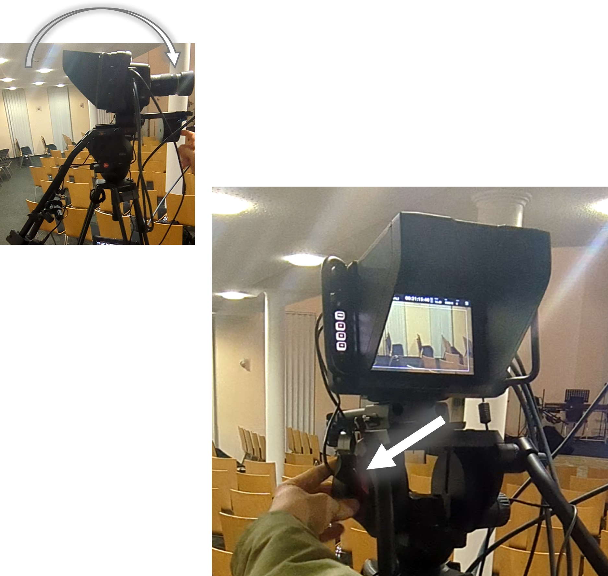
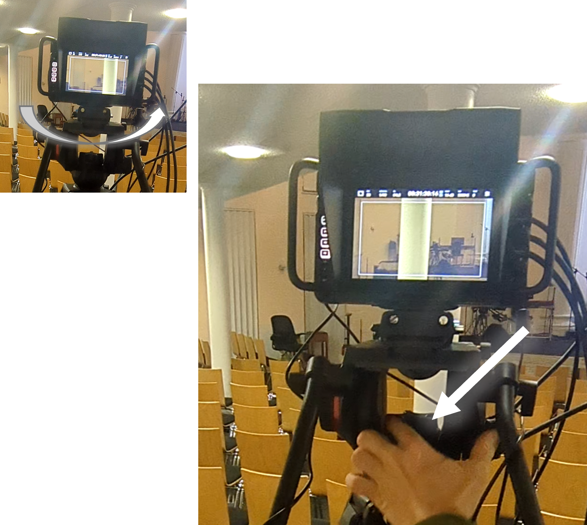
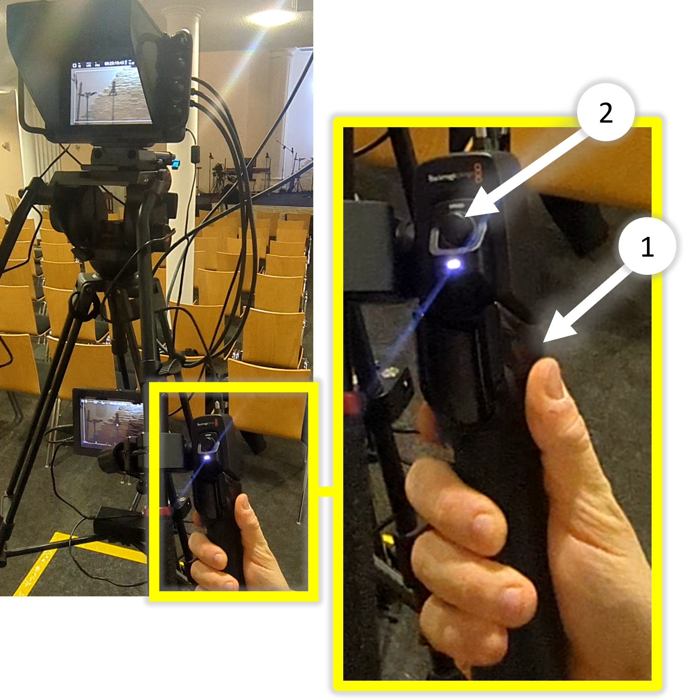

# Stativ

---

## Sonnenblende

- Die Sonnenblende Schützt vor Blendendem Licht und Verhindert dass das Publikum durch den Bildschirm abgelenkt wird.
- Vor dem Benutzen muss die Sonnen blende aufgeklappt werden.

---

## Friktion einstellen

Die Friktion ist korrekt eingestellt, wenn folgende Punkte erfüllt sind:

✅ Eine schräge Kamerabewegung lässt sich ruhig, gleichmäßig und ohne Wackeln ausführen.

✅ Die Kamera bleibt in ihrer Position stehen, wenn die Griffe losgelassen werden.

- Es ist üblich, während dem GoDi die Friktion zu ändern. Beispielsweise braucht man während dem Lobpreis eine leichtere Friktion als während der Predigt

### Neigen

- Hier wird die Friktion für das Neigen der Kamera (hoch/runter) eingestellt.

### Schwenken

- Hier wird die Friktion für das Schwenken der Kamera (links/rechts) eingestellt.

---

## Bremse

- Mit diesen beiden Bremsen kann das Stativ vollständig verriegelt werden.
- Die Bremse sollte nicht zum Einstellen der Friktion verwendet werden.
- Sie dient eher als Sicherung, vergleichbar mit der Handbremse bei einem Auto.

---

## Griffe einstellen

- Die Griffe sollten so eingestellt sein, dass sich die Kamera bequem und kontrolliert mit minimalem Kraftaufwand bewegen lässt.

- Idealerweise kann die Bewegung locker mit einem Finger ausgeführt werden.

## Griff-Position einstellen

1. Schraube lösen
2. Position einstellen (Innen/Außen)

## Griff-Länge einstellen

1. Schraube lösen
2. Länge einstellen (Länger/Kürzer)

---

## Zoom
1. Rein und raus Zommen
2. Zoomgeschwindigkeit einstellen (Sollte auf Mitte stehen)

## Fokus
- Drehen um die Fokus-Tiefe einzustellen

> [!WARNING]
> Gleichzeitig zu Zoomen und den Fokus einzustellen ist schwierig und sollte vermieden werden
