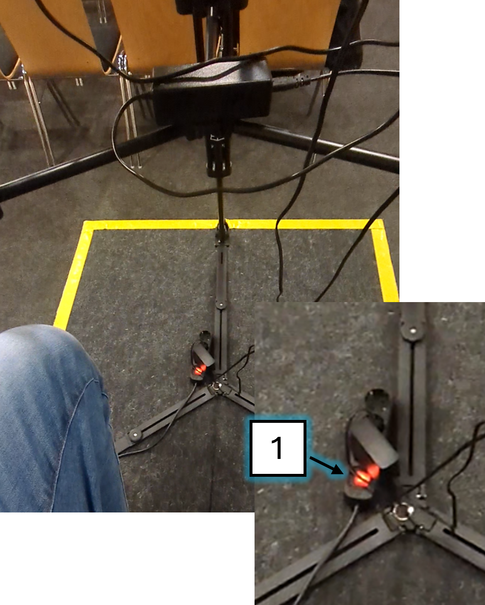
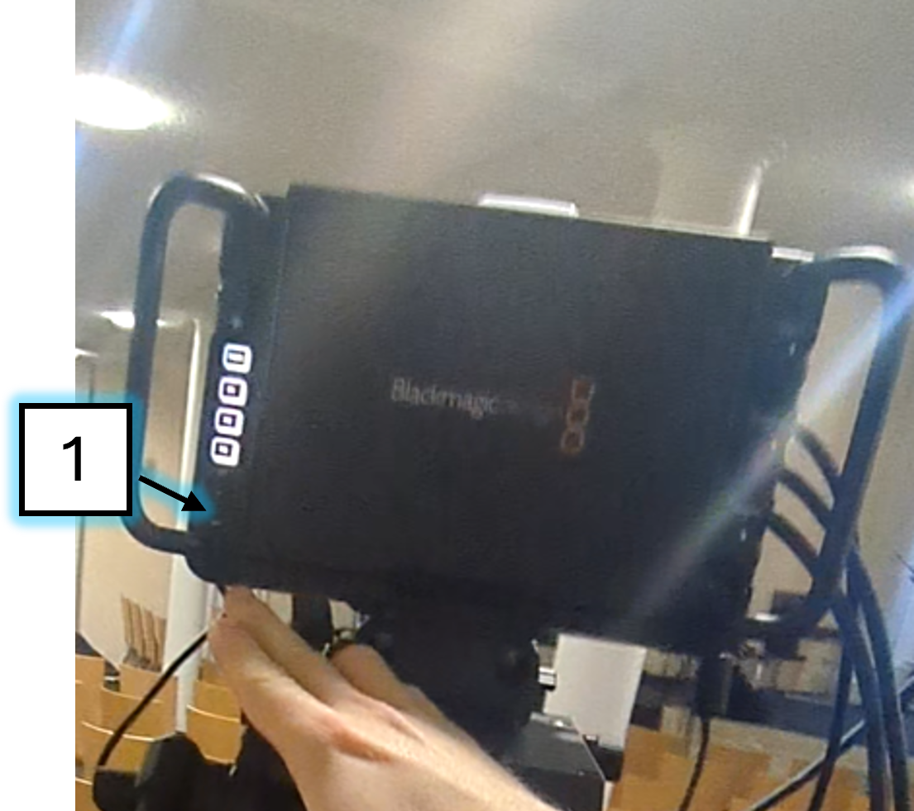
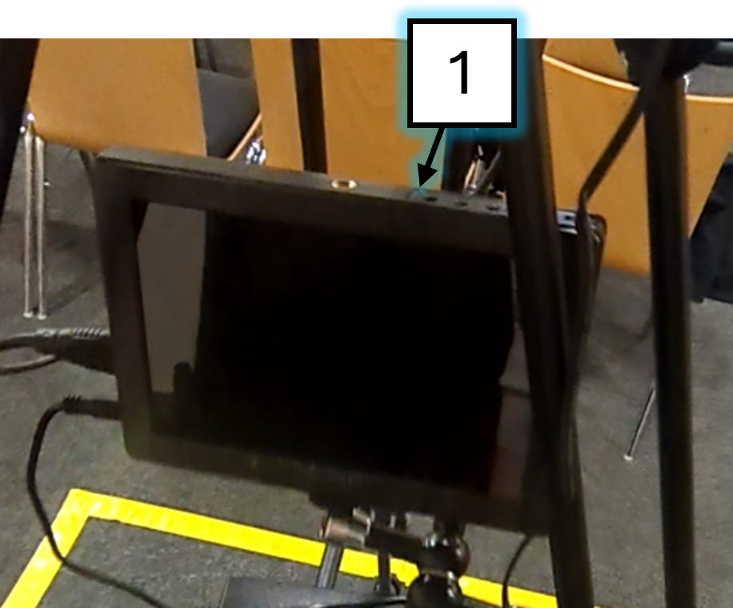
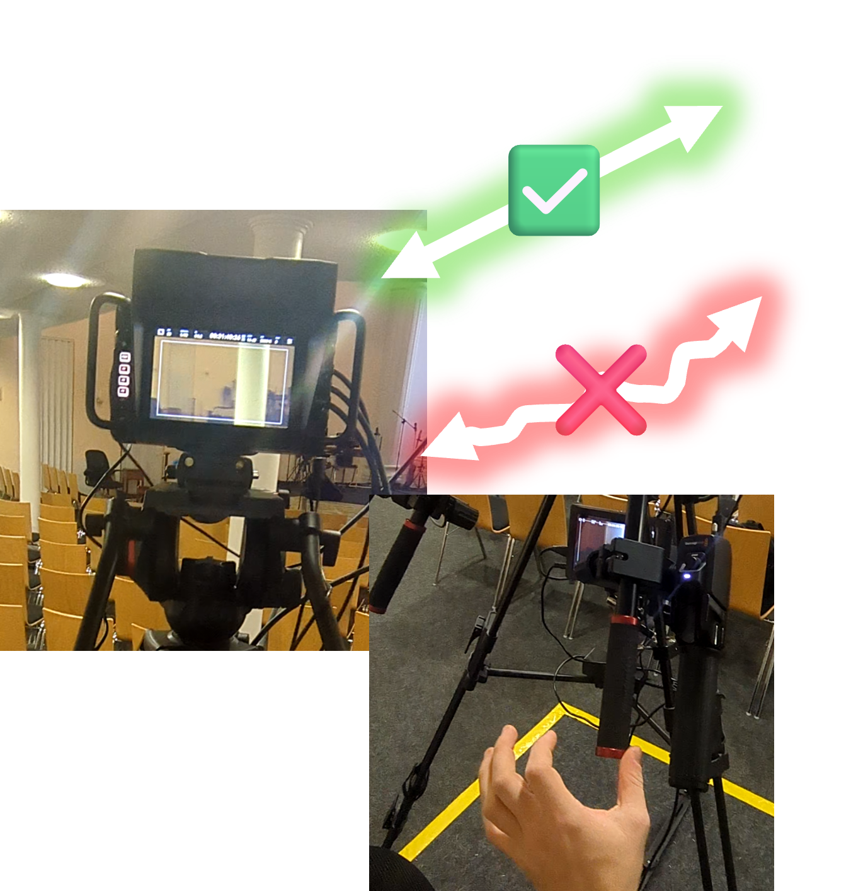
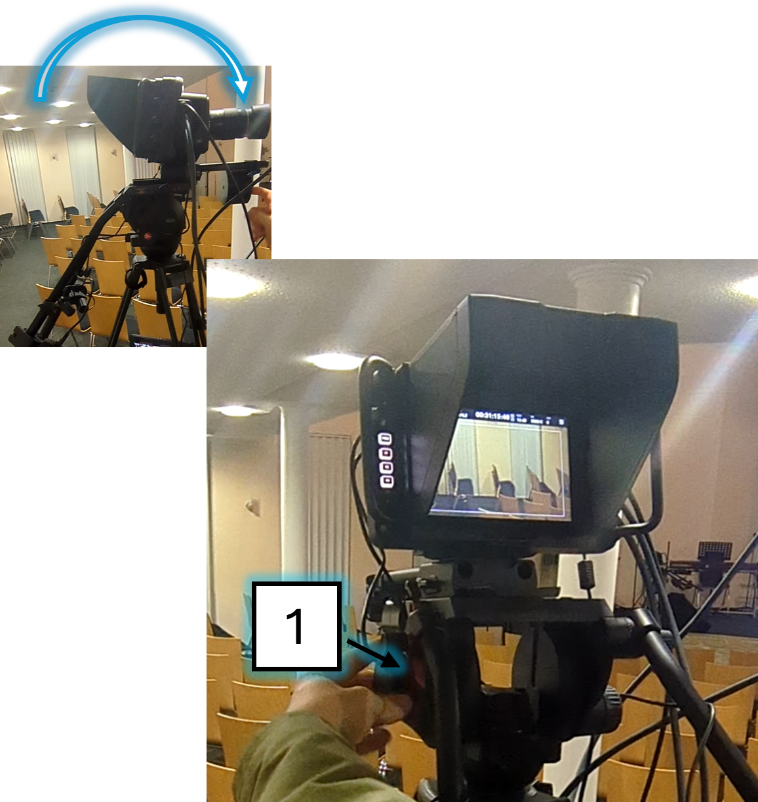
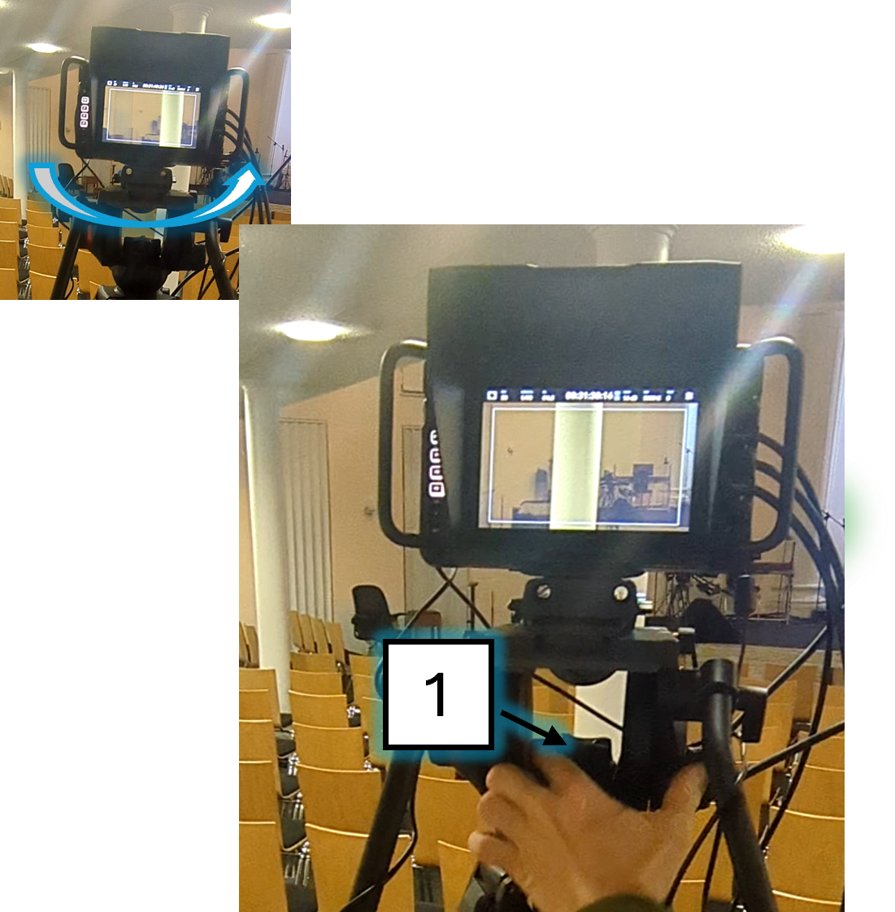
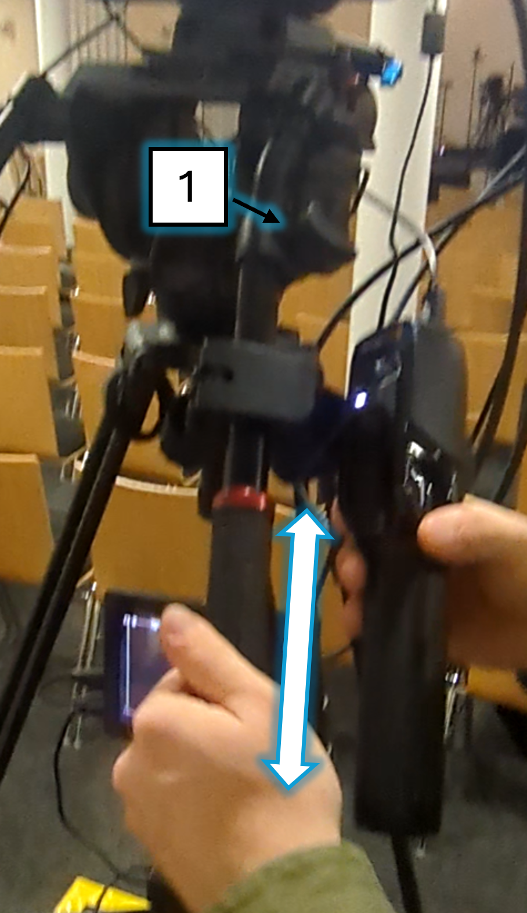
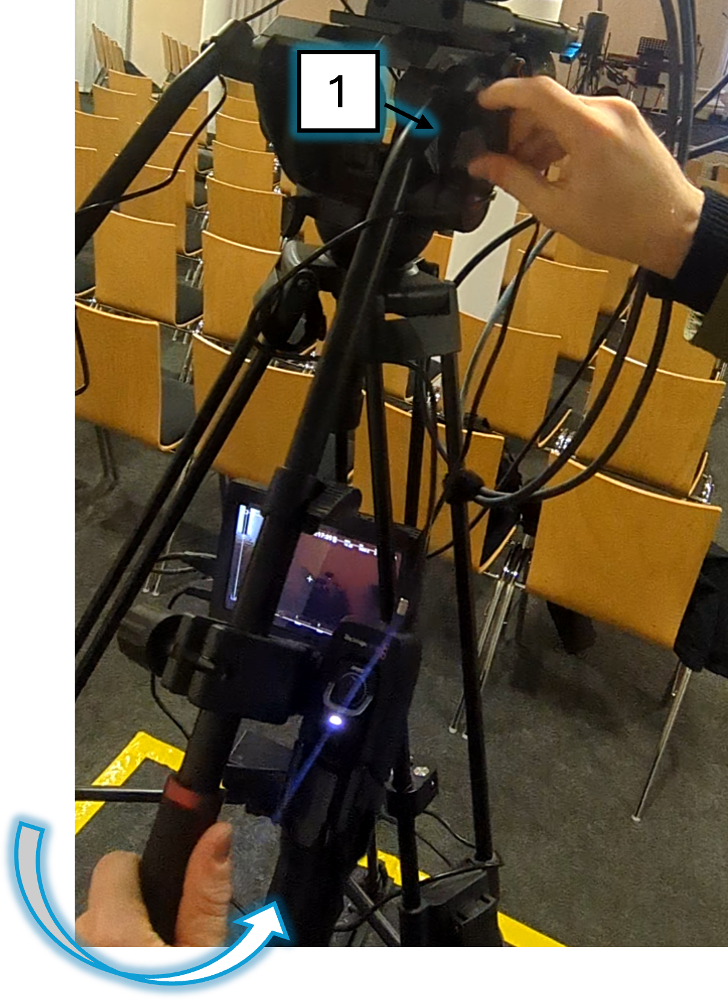

# Stativ Kamera (Basic)

---

## 1. Anschalten

> ✅ Schalte den Strom ein
> 
> 

> ✅ Schalte die Kamera ein (Falls sie nicht von alleine an geht)
> 
> 

> ✅ Schalte das Display ein (Falls es nicht von alleine an geht)
> 
> 

---

## 2. Einstellen

> ✅ Stelle den Blende-Parameter ein
> 
> 

> ✅ Stelle die Friktion so ein, dass sich eine diagonale Linie bequem und ohne Wackeln mit 2 Fingern abfahren lässt
> 
> 
>
> ---
>
> ### Friktion 'Neigen' einstellen
>
> 
>
>> **TIPP:** Während der Predigt ist es hilfreich die Neigung mit dieser Bremse festzusetzen.
>>
>> 
>
> ---
>
> ### Friktion 'Schwenken' einstellen
>
> 
>
> ---
>
> ### Griffe 'Länge' einstellen
>
> 
>
> ---
>
> ### Griffe 'Position' einstellen
>
> 

---

## 3. Bedienen

> ### 'Zoom' einstellen
>
> 

> ### 'Fokus' einstellen
>
> 

---

## 4. Ausschalten

> ✅ Schalte die Kamera aus
> 
> 

> ✅ Schalte den Strom aus
> 
> 