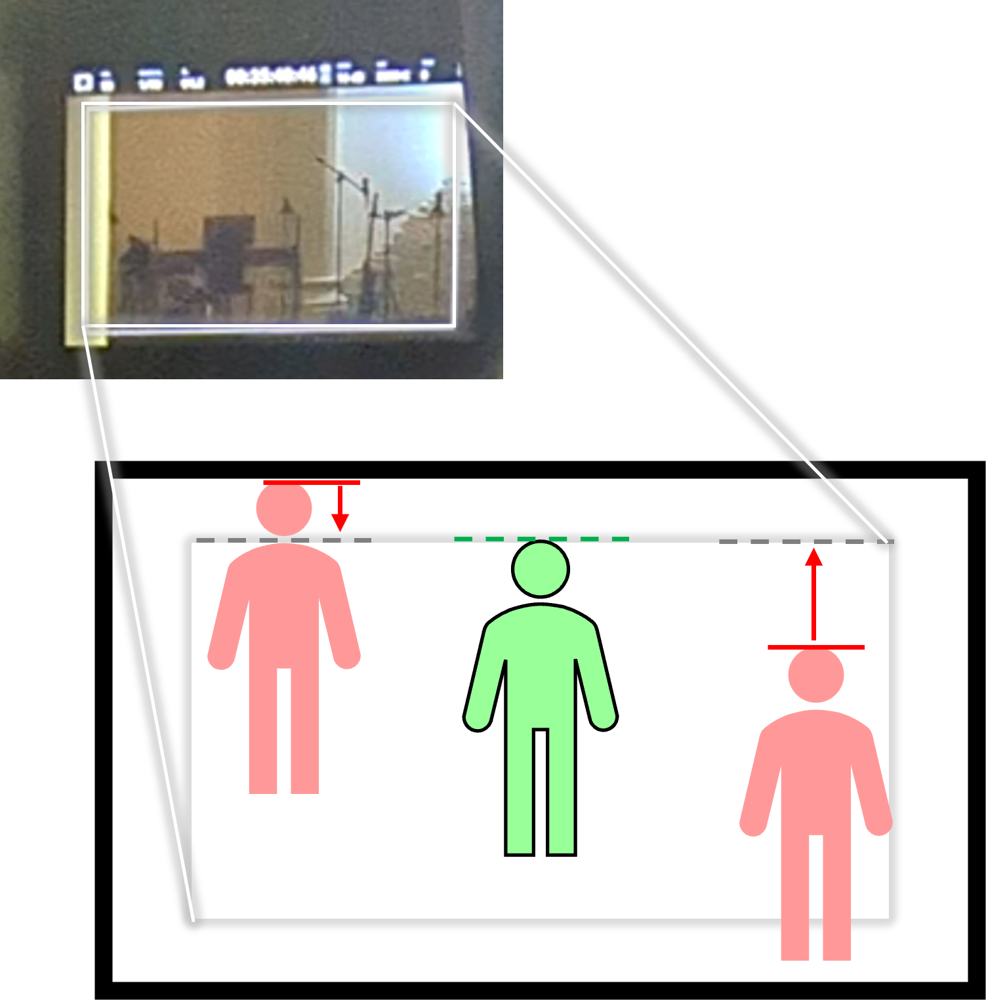
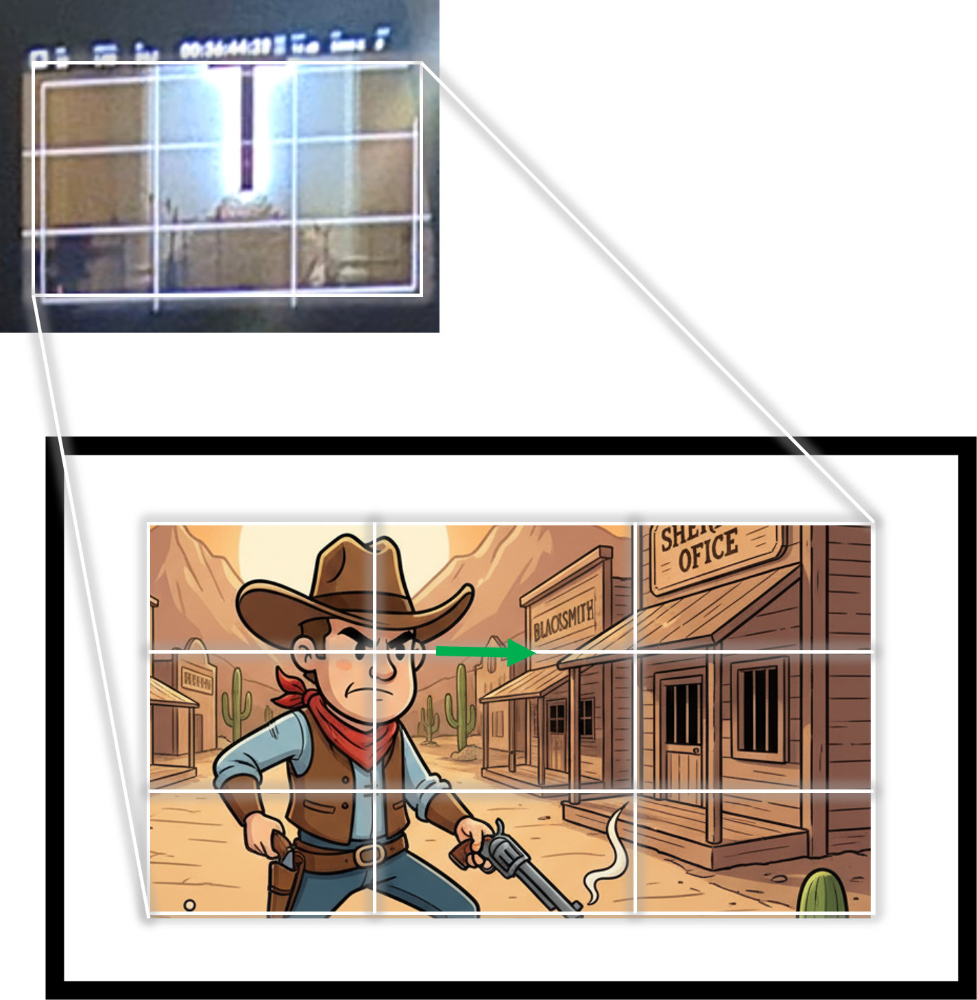

# Theorie

## Regeln

- Schneide keine Gesichter

---

## Komposition - Symetrie

- Kopf sollte an der Oberen Hilfslinie aufhören
- Person möglichst in der Mitte

---

## Komposition - Drittel

- Augen an den oberen Kreuzen Orientieren
- Durch Bewegung oder Blickrichtung Motiviert

---

## Kamera - Einstellgrößen

### Halbtotale (Füße)

---

### Amerikanische (Knie) 🤓 Kommt von Western Filmen, wegen der Pistole im Halfter

---

### Halbnahe (Gürtel)

---

### Nahe (Brust)

