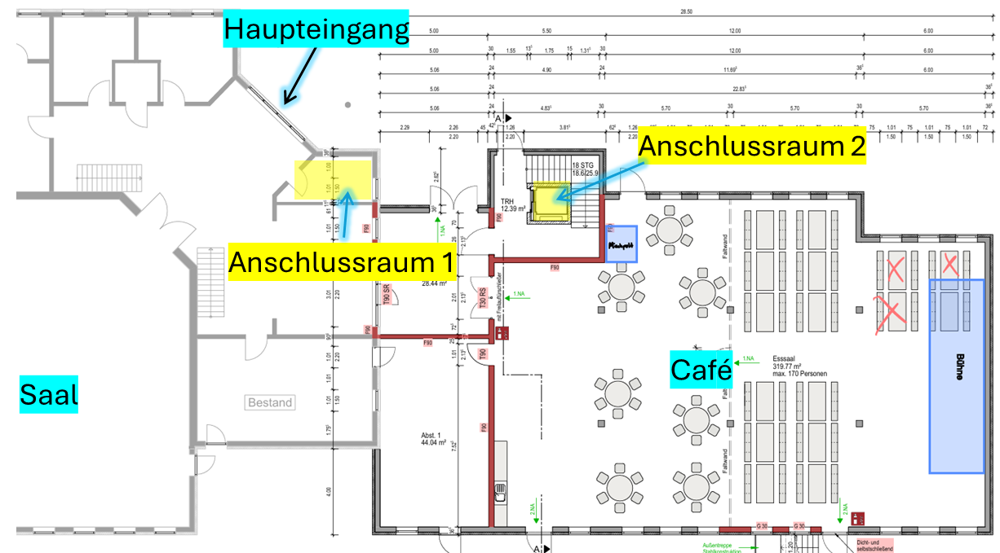
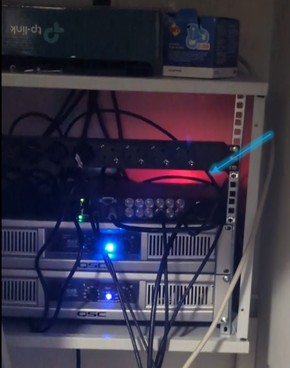
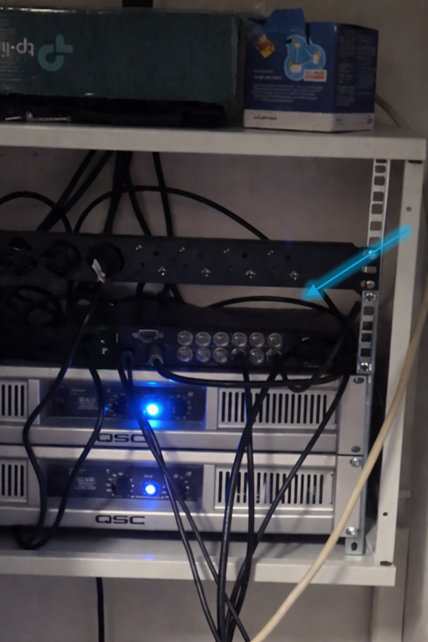
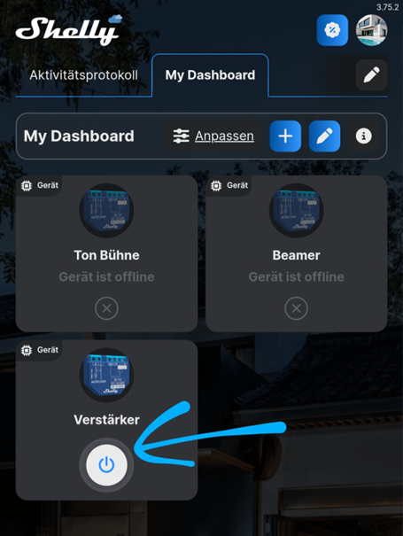
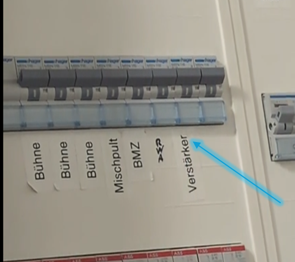
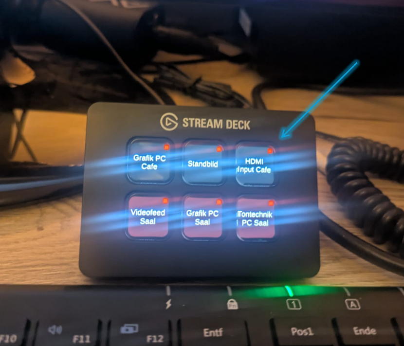
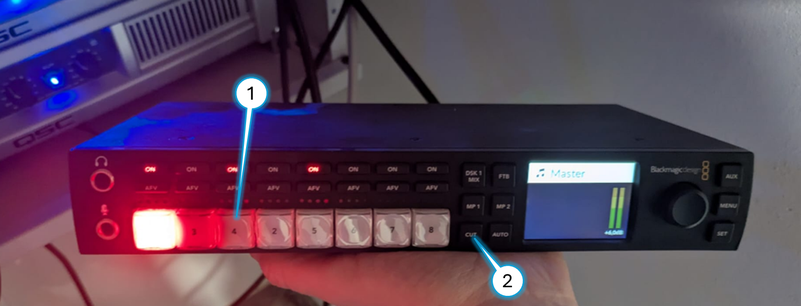

# Trouble Shooting

## Anschlussräume

- Es gibt 2 Anschlussräume
    - Anschlussraum 1 (im Bestandsgebäude)
    - Anschlussraum 2 (im Anbau/Café)

## ⚠️ Fehler: Kein Bild im Café

###  🔎 Prüfen: Läuft der Bildmischer?

*Wo: Anschlussraum 2 (Anschlussraum im Anbau)*

> - ✅ Bildmischer leuchtet rot -> Er ist an
>
> 

> - ❌ Bildmischer leuchtet nicht -> Er ist aus
>
> 
>
> - ➡️ Shelly 'Verstärker' aus und wieder an machen
>   - Wenn der Bildmischer dadurch an geht, hört man ein 'huuuiiii' (der Lüfter vom Bildmischer) -> ✅ Dann sollte der Bildmischer rot leuchten und alles funktionieren
>
>   

> - ❌ Bildmischer leuchtet immer noch nicht -> Er ist aus
> 
>     - Im Schaltkasten 'Verstärker' aus und wieder an schalten
>     - Dann in Shelly 'Verstärker' aus und wieder anschalten

## ⚠️ Fehler: Streamdeck funktioniert nicht

ℹ️ An den roten Punkten kann man erkennen, dass das Streamdeck keine Verbindung zum Bildmischer hat.

### 🔎 Prüfen: [Läuft der Bildmischer](#-prüfen-läuft-der-bildmischer)

### 🔃 Workaround: Schalte die Grafik-Quelle direkt am Bildmischer

*Wo: Anschlussraum 2 (Anschlussraum im Anbau)*

> ➡️ drücke bei dem Bildmischer im Anschlussraum 1 auf 'Qelle 4'(1) (Für den GrafikPc-Café) und anschließend auf 'CUT'(2)
>
> Jetzt sollte der Café-Beamer die Inhalte vom GrafikPc-Café anzeigen ✅
>
> 

<!-- ### 🔎 Prüfen: Läuft der Flurbildschirm?

🚧 Baustelle 🚧

*Wo: Anschlussraum 1 (Anschlussraum im Bestandsgebäude)*

Wenn der Flurbildschirm nicht läuft, dann ist etwas zwischen dem Saal-PC und dem  nicht in ordnung. -->
