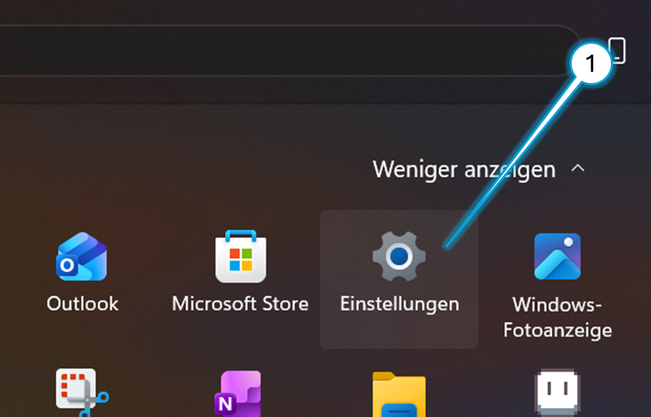
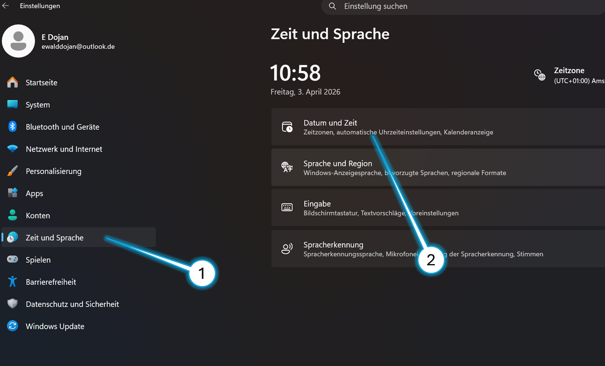
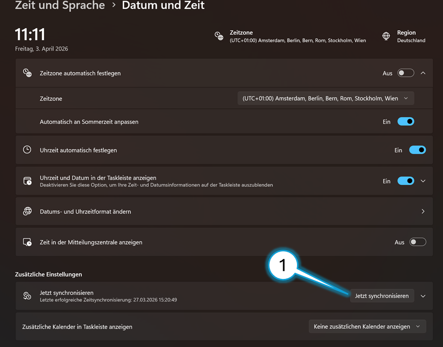

# Uhrzeit Synchronisieren

> Öffne die Einstellungen
> 
> 

> klicke 'Zeit und Sprache' -> 'Datum und Zeit'
> 
> 

> Auf 'Jetzt Synchronisieren' klicken
> 
> 

> Das Passwort ist `HeRRJeSUS!` (Also so wie das normale Anmelde-Passwort nur mit einem `!` dahinter)
