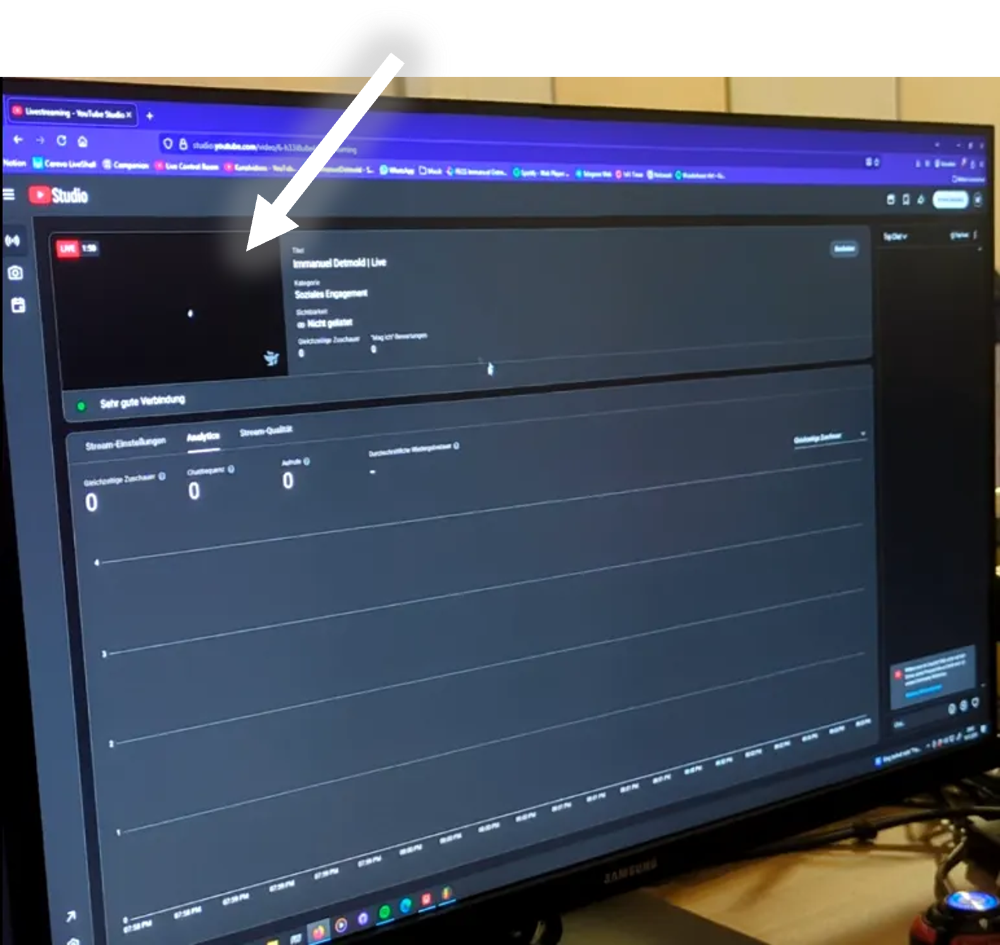
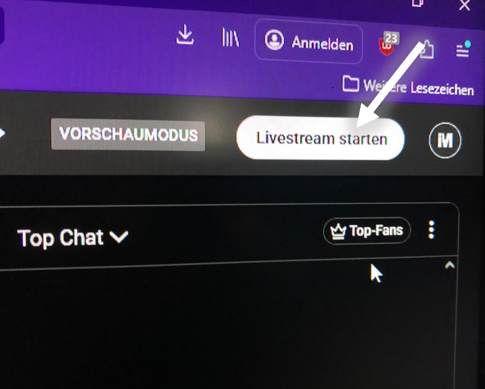

# Youtube Control Room

---

## Stream Starten

- in Firefox Web-Link öffnen

- Laufenden Stream wählen

- Hier sieht man eine Preview von dem Bild das man senden würde, aber es ist noch nicht Live

- Live geht es erst wenn man hier ‘Stream Starten’ anklickt

---

## Beenden

- Mit dem Butten ‘Stream Beenden’ beendet man den Stream (Wer hätte das gedacht 🤓)

